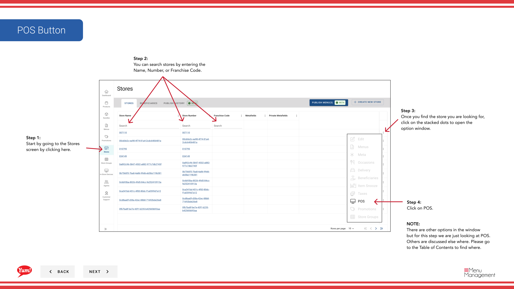

# POS

## Was diese Anleitung deckt

Zeigt die angeschlossenen Point-of-Sale-Geräte eines Speichers, ihren Status und ermöglicht es den Betreibern, Geräteeinstellungen zu aktualisieren oder einmalige Passwörter für die Geräteauthentifizierung zu generieren.

:::note Byte POS Caveat
Diese Seite beschreibt den Admin Portal Flow für **Byte POS-connected** Gerätemanagement.

Wenn der Markt Byte POS nicht nutzt, spricht Byte Commerce **not** direkt mit diesem Markt POS. **Byte Connect** muss als Brücke an Bord sein, und der genaue Betriebsablauf kann von den hier gezeigten Gerätestufen abweichen.
:::

## Schritte

**Step 1:** Navigieren Sie mit dem linken Navigationsmenü in den Abschnitt **Stores**.

**Step 2:** Suche nach dem Store nach **Name*, **Store Number** oder **Franchise Code*** mit dem Suchfeld.

**Step 3:** Sobald Sie den Speicher finden, klicken Sie auf das **dree-dot Menü* (••) Symbol, um das Optionen Menü zu öffnen.

**Step 4:** Klicken Sie im Dropdown-Menü auf **POS**. Dies zeigt alle mit dem ausgewählten Speicher verbundenen Point-of-Sale-Geräte an.

**Step 5:** Überprüfen Sie die POS Gerätetabelle, die zeigt:

| Spalte | Was es bedeutet |
|--------|--------------|
| **Gerätename** | Anzeigename des POS-Geräts |
| **Station Typ** | Art der POS-Station (z.B. Register, Küche, Zähler) |
| **Beratungsstatus** | Aktueller Status (Online, Offline, Inactive, etc.) |
| **Menu Veröffentlicht** | Datum, das Menü wurde zuletzt veröffentlicht |
| ** Letzter Check-in** | Datum und Uhrzeit der letzten Kommunikation mit Atlas |

**Step 6:** Verwenden Sie die Aktionstasten, um Geräte zu verwalten:
- Klicken Sie auf **Aktualisieren der Geräteeinstellungen**, um die Gerätekonfiguration (Name, Einstellungen usw.) zu ändern.
- Klicken Sie auf **Generieren Sie ein Zeit-Passwort**, um ein temporäres Passwort für die Geräteauthentifizierung zu erstellen

:::tip
Verwenden Sie **Last Check-in**, um zu überprüfen, ob POS-Geräte aktiv mit Atlas kommunizieren. Wenn ein Gerät nicht vor kurzem überprüft wurde, kann es offline oder getrennt werden.
:::

:::tip
Geräte, die offline sind oder nicht einchecken sollten untersucht werden, um sicherzustellen, dass Menü-Updates ordnungsgemäß geliefert werden.
:::

## Ähnliche Anleitungen

- [Details zum Shop bearbeiten](/docs/admin-portal-guide/stores/edit-store-details/)— Andere Speicherinformationen anzeigen
- [Byte Connect](/docs/byte-capabilities/enablement/byte-connect)— Verstehen, wenn nicht-Byte POS-Märkte Byte Connect benötigen

---

* Teil der[Admin Portal Guide](/docs/admin-portal-guide)· Abschnitt: Geschäfte*
