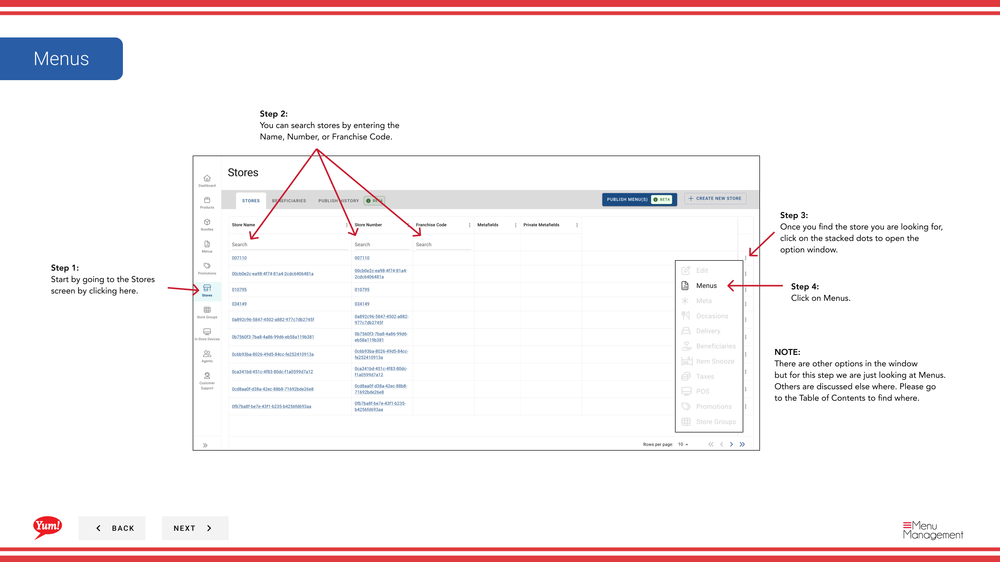

# Über uns

## Was diese Anleitung deckt

Kopiert die Patch-Listen-Konfiguration eines Speichers in einem oder mehreren anderen Speichern, Streamlining Patch-Management über mehrere Standorte mit den gleichen Overrides.

## Schritte

**Step 1:** Navigieren Sie mit dem linken Navigationsmenü in den Abschnitt **Stores**.

**Step 2:** Suche nach dem **source Store** (der Store, dessen Patches Sie kopieren möchten) durch **Name**, **Store Number** oder **Franchise Code***.

**Step 3:** Sobald Sie den Speicher finden, klicken Sie auf das **dree-dot Menü* (••) Symbol, um das Optionen Menü zu öffnen.

**Step 4:** Klicken Sie auf **Menus** im Dropdown-Menü.

**Step 5:** Suchen Sie den Kanal mit Patches, die Sie übertragen möchten, und klicken Sie auf die **mehr Menü* Taste (.) in dieser Zeile.

**Step 6:** Klicken Sie im Menü Optionen auf **Transfer Patchliste**.

**Step 7:** Wählen Sie die **patches** aus, die Sie überweisen möchten, indem Sie ihre Namen überprüfen. Überprüfen Sie die Liste der zu kopierenden Patches.

**Step 8:** Wählen Sie die ** Destination Stores* aus, in denen Sie diese Patches kopieren möchten. Sie können:
- Speicher nach Namen, Nummer oder Code suchen
- Filtern nach **Store Group** mit dem Dropdown, um schnell alle Filialen in einer Gruppe auszuwählen

**Step 9:** Wählen Sie den **menu-Kanal*, in dem die Patches auf den Zielmärkten (z.B. Digital, Kiosk, In-Store) aufgetragen werden sollen.

**Step 10:** Überprüfen Sie die Transferdetails, um alles zu überprüfen ist korrekt, bevor Sie fortfahren.

**Step 11:** Klicken Sie auf **Save** (oder **Transfer**) um die Patches in die ausgewählten Zielspeicher zu kopieren.

:::tip
**Store Groups shortcut:** Verwenden Sie die **Store Group* Filter Dropdown, um schnell alle Filialen in einer Region oder Franchise-Gruppe auszuwählen, anstatt nach jedem einzelnen Store zu suchen.
:::

:::tip
Transfer kopiert die Patches, wie sie bestellt werden. Nach dem Transfer überprüfen Sie, ob die Patches korrekt an den Zielmärkten arbeiten, bevor Sie an Kunden veröffentlichen.
:::

## Ähnliche Anleitungen

- [Patch-Liste bearbeiten](/docs/admin-portal-guide/stores/edit-patch-list/)— Patches auf einem einzelnen Speicher verwalten
- [Menü veröffentlichen](/docs/admin-portal-guide/stores/publish-menu/)— Veröffentlichen Sie das Menü nach der Übertragung von Patches

---

* Teil der[Admin Portal Guide](/docs/admin-portal-guide)· Abschnitt: Geschäfte*