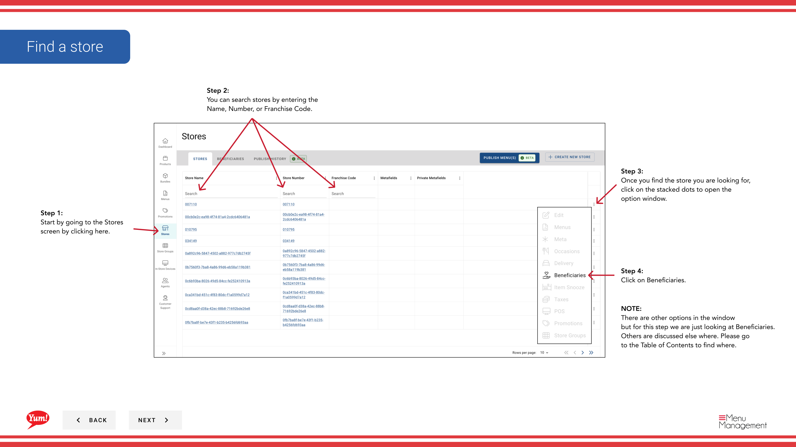

# Nutzen eines Stores anzeigen

## Was diese Anleitung deckt

Listet die Begünstigten, die mit einem bestimmten Speicher für Sichtbarkeit und Management verbunden sind.

## Schritte

**Step 1:** Navigieren Sie mit dem linken Navigationsmenü in den Abschnitt **Stores**.

**Step 2:** Suche nach dem Store nach **Name*, **Store Number** oder **Franchise Code*** mit dem Suchfeld.

**Step 3:** Sobald Sie den Speicher finden, klicken Sie auf das **dree-dot Menü* (••) Symbol, um das Optionen Menü zu öffnen.

**Step 4:** Klicken Sie im Dropdown-Menü auf **Beneficiaries**. Dies zeigt alle Empfänger, die mit dem ausgewählten Speicher verbunden sind.

**Step 5:** Verwenden Sie das Suchfeld, um die Empfänger nach **name* zu filtern, wenn die Liste lang ist.

Die Tabelle zeigt:
- ** Name des Empfängers* — Der Name der Nächstenliebe oder Ursache
- **Akzeptieren von Spenden* — Statusanzeige (grünes Kontrollzeichen = aktive Spenden)

:::tip
Um einen bestimmten Speicher von einem Begünstigten zu entfernen, gehen Sie zu[Bearbeiten/Entlassen eines Steuerempfängers](/docs/admin-portal-guide/stores/editdelete-a-beneficiary/)und wählen Sie den Speicher aus der Liste der Associated Stores aus.
:::

## Ähnliche Anleitungen

- [Beneficiary erstellen](/docs/admin-portal-guide/stores/create-a-beneficiary/)— Einrichtung eines neuen Begünstigten
- [Bearbeiten/Entlassen eines Steuerempfängers](/docs/admin-portal-guide/stores/editdelete-a-beneficiary/)— die Begünstigten aktualisieren oder entfernen

---

* Teil der[Admin Portal Guide](/docs/admin-portal-guide)· Abschnitt: Geschäfte*