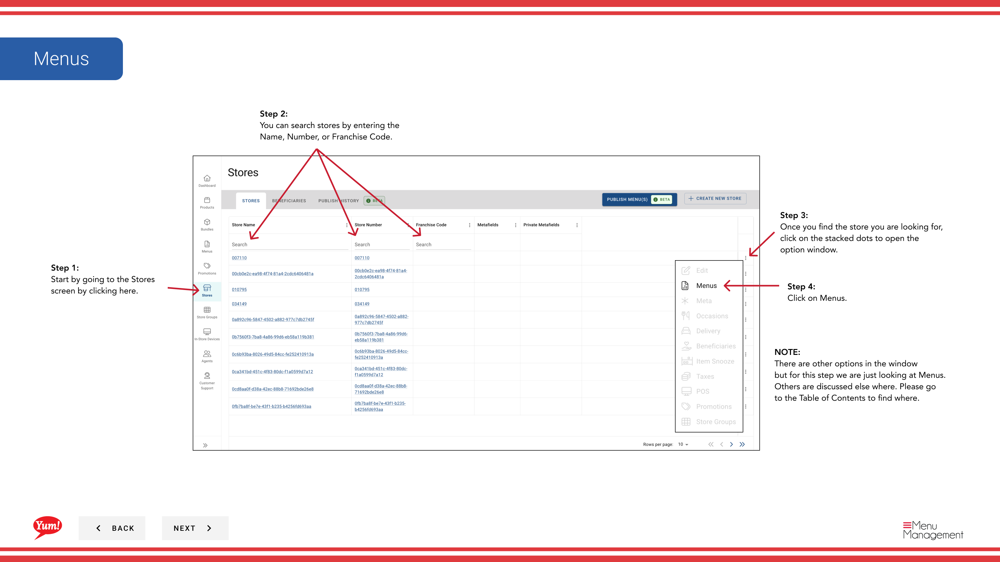

# Menü eines Stores anzeigen

## Was diese Anleitung deckt

Zeigt alle Menüs, die einem Speicher zugeordnet sind, an, welches Menü auf jedem Bestellkanal aktiv ist (Digital, Kiosk, In-Store, etc.).

## Schritte

**Step 1:** Navigieren Sie mit dem linken Navigationsmenü in den Abschnitt **Stores**.

**Step 2:** Suche nach dem Store nach **Name*, **Store Number** oder **Franchise Code*** mit dem Suchfeld.

**Step 3:** Sobald Sie den Speicher finden, klicken Sie auf das **dree-dot Menü* (••) Symbol, um das Optionen Menü zu öffnen.

**Step 4:** Klicken Sie auf **Menus** im Dropdown-Menü. Dies zeigt alle Menüs, die diesem Speicher zugeordnet sind, organisiert von Kanal.

Die Menütabelle zeigt:
- **Channel** Der Bestellkanal (z.B. Digital, Kiosk, In-Store)
- **Menu Name* — Name des zugewiesenen Menüs
- **Status** — Aktueller Veröffentlichungsstatus (veröffentlicht, Entwurf usw.)

:::tip
Aus dieser Ansicht können Sie auch neue Menüs zuordnen, Menüs veröffentlichen, Patchlisten bearbeiten oder Patchlisten übertragen. Nutzen Sie die Menütasten oder das Dreipunktmenü in jeder Kanalzeile, um auf diese Optionen zuzugreifen.
:::

## Ähnliche Anleitungen

- [Neues Menü zuordnen](/docs/admin-portal-guide/stores/assign-new-menu/)— Verlinken Sie ein Menü auf einen Speicherkanal
- [Menü veröffentlichen](/docs/admin-portal-guide/stores/publish-a-menu/)— Machen Sie ein Menü live für Kunden
- [Patch-Liste bearbeiten](/docs/admin-portal-guide/stores/edit-patch-list/)— Überschreiben Sie Elemente in einem Menü für diesen Speicher

---

* Teil der[Admin Portal Guide](/docs/admin-portal-guide)· Abschnitt: Geschäfte*