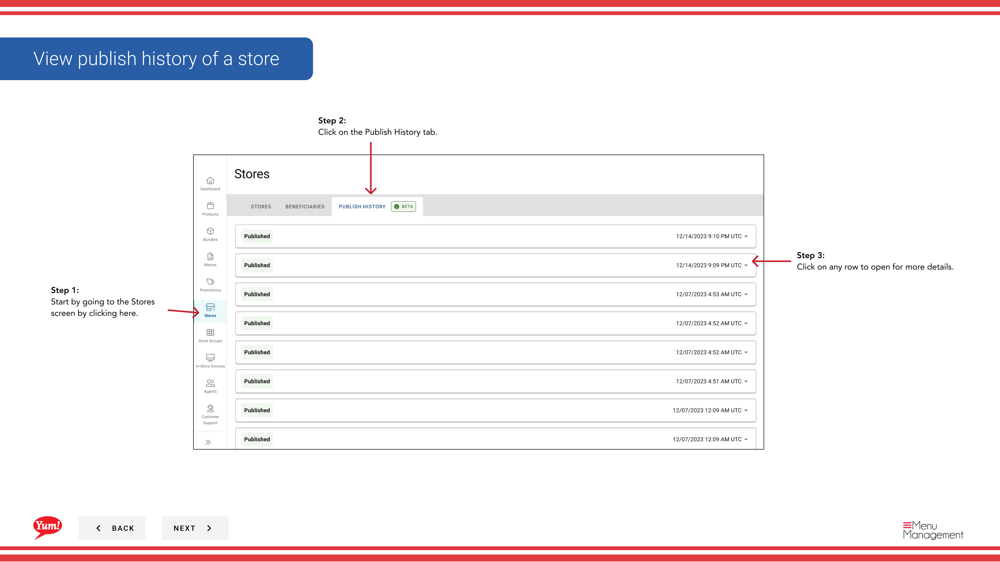

# Anzeigen eines Stores Publish History / Copy Menu Job ID veröffentlichen

## Was diese Anleitung deckt

Zeigt ein Protokoll aller Menü-Veröffentlichung Jobs für einen Speicher, einschließlich Status und Zeitstempel. Sie können Details zu jedem veröffentlichten Job anzeigen und die Menu Publish Job ID für Supportzwecke kopieren.

## Schritte

**Step 1:** Navigieren Sie mit dem linken Navigationsmenü in den Abschnitt **Stores**.

**Step 2:** Klicken Sie auf die Registerkarte **Verlauf** oben auf der Seite Stores.

**Step 3:** Die Publikationsliste zeigt:
- **Menu** Name des veröffentlichten Menüs
- **Channel** — Bestellkanal (Digital, Kiosk, In-Store, etc.)
- **Status** — Veröffentlichungsstatus (Erfolg, Pending, Failed, etc.)
- **Zeitstempel** — Datum und Uhrzeit des Veröffentlichens

Klicken Sie auf jede Zeile, um die vollständigen Details zu öffnen, einschließlich der **Menu Publish Job ID**.

**Step 4:** Um die **Menu Publish Job ID** zu kopieren, klicken Sie auf das **copy**-Symbol neben dem Feld Job ID im Detailfeld.

:::tip
**When to use Menu Publish Job ID:** Bei der Kontaktaufnahme mit Atlas Support über eine Publikationsausgabe, beinhalten Sie die Menu Publish Job ID, um dem Support-Team zu helfen, schnell den spezifischen Job zu finden und das Problem zu diagnostizieren.
:::

## Ähnliche Anleitungen

- [Menü veröffentlichen](/docs/admin-portal-guide/stores/publish-a-menu/)— Menüs zu Kanälen veröffentlichen
- [Menü eines Stores anzeigen](/docs/admin-portal-guide/stores/view-a-stores-menu/)— Siehe aktuell zugewiesene Menüs

---

* Teil der[Admin Portal Guide](/docs/admin-portal-guide)· Abschnitt: Geschäfte*