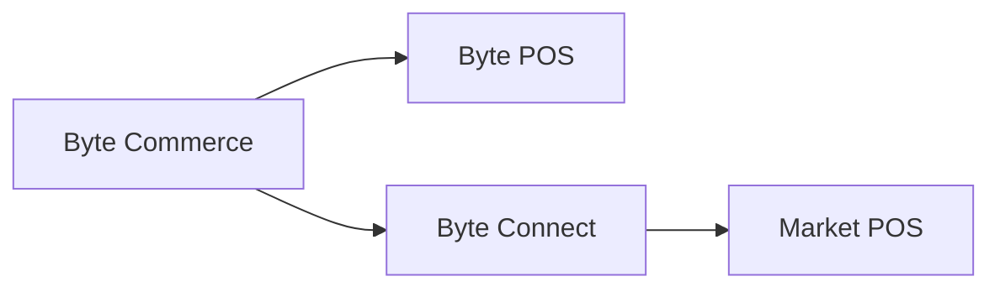

# Byte Connect

> Im Atlas-Kontext ist Byte Connect die Integrationsschicht innerhalb der Byte-Plattform, die wichtig wird, wenn Byte Commerce eine nicht-Byte POS-Umgebung oder einen externen Vertriebskanal erreichen muss.

---

## Atlas Context

Innerhalb von Atlas Wiki sollte Byte Connect als Teil des breiteren **Atlas + Byte Commerce + Byte Portal**-Betriebsbildes verstanden werden.

- **Atlas** ist das globale Frontend von KFC
- **Byte Commerce** übernimmt Transaktionslogik und Auftragsorchester
- **Byte Portal** ist die Hauptverwaltungsoberfläche für Markt und Ops-Konfiguration
- **Byte Connect** ist die Integrationsschicht, die verwendet wird, wenn externe Channel Routing oder nicht-Byte POS-Konnektivität beteiligt ist

Das bedeutet, Byte Connect ist nicht das kundenorientierte Produkt und nicht das tägliche UI, aber es ist immer noch Teil des Byte-Stacks, wenn Märkte von Drittkanalintegrationen oder einem nicht-Byte POS-Setup abhängig sind.

---

## Kernregel

Wenn ein Markt **not** mit **Byte POS** ist, muss **Byte Connect im Rahmen von Byte Commerce onboarding* an Bord sein.

Byte Commerce ist verkabelt, um direkt mit **Byte POS* zu sprechen. Für nicht-Byte POS-Märkte sitzt Byte Connect in der Mitte und behandelt den Integrationspfad zum Markt POS.

---

## Was Byte Connect macht

Byte Connect fungiert als Integrationslösung innerhalb der Byte-Plattform, die in erster Linie durch die **Business API** verwaltet wird, die Läden und Marken verbindet Byte Commerce mit:

- Nicht-Byte POS Umgebungen
- Drittanbieter-Lieferplätze
- andere externe Vertriebskanäle

In Atlas-Bedingungen bedeutet dies, dass Byte Connect die Schicht ist, die hilft, die Plattform über den Standard zu erreichen **Byte Commerce -> Byte POS** Weg.

Das heißt, das funktionierende mentale Modell ist:

- **Byte Commerce -> Byte POS**, wenn der Markt Byte POS verwendet
- **Byte Commerce -> Byte Connect -> POS**, wenn der Markt nicht verwendet Byte POS

Das wichtigste, um zu vermeiden, ist, dass Byte Commerce kann direkt mit jedem Markt POS oder externen Kanal standardmäßig sprechen. Es kann nicht. Ist Byte POS nicht vorhanden oder hängt der Markt von unterstützten Kanalintegrationen Dritter ab, wird Byte Connect Teil des Pfades.

---

## Schlüsselfähigkeiten

Byte Connect unterstützt:

- **Vertriebskanäle von Drittanbietern** wie Uber Eats, DoorDash, Grubhub, Just Eat und Deliveroo
- **Channel-Level-Preiskontrollen**, einschließlich marktplatzspezifischer Markup-Konfiguration
- **Lieferungsmöglichkeiten** für jeden Kanal, z.B. marktplatzgefüllte Lieferung vs. intern erfüllte Lieferung
- **Anweisungsregeln** zur Unterstützung der ordnungsgemäßen Auftragsabwicklung nachgelagert
- **Store-Level-Kanal-Konfiguration* durch Business API-Operationen wie`updateByteConnectStoreChannelConfig`

Dies ist die nützlichste Möglichkeit, Byte Connect in Atlas zu kontextualisieren: Es ist nicht nur ein generisches Steckverbinder. Es handelt sich um eine konfigurierte Integrationsschicht, die regelt, wie die Geschäfte eines Marktes mit externen Lieferkanälen interagieren und gegebenenfalls wie Byte Commerce die nicht-Byte POS-Infrastruktur erreicht.

---

## Was das für ein Onboarding bedeutet

Für nicht-Byte POS-Märkte ist Byte Connect kein optionales Add-on. Es ist Teil des Byte Commerce onboarding Bündels.

Teams planen Markt-Setup, Rollout-Bereich, Zeitlinien, Integration Verantwortlichkeiten oder Aggregator Onboarding sollte Byte Connect als Standardabhängigkeit behandeln, wenn:

- Der Markt POS ist nicht Byte POS
- der Markt hängt von unterstützten Drittanbieter-Lieferkanälen ab
- Speicherebene externe Kanalregeln müssen zentral konfiguriert oder geregelt werden

In praktischen Atlas-Begriffen bedeutet dies, dass die Startplanung Byte Connect als Teil der Integrationsbereitschaft behandeln sollte, nicht als Nachfolge nach Frontend und Portal-Setup sind bereits abgeschlossen.

---

## Operationelle Höhle

Viele Byte Connect-Funktionen werden derzeit als **BETA** beschrieben, und einige Operationen können in jeder Produktionsumgebung nicht verfügbar sein. Der Zugang zu diesen Operationen erfordert in der Regel die`byte_connect`Rolle in der Business API.

Das ist für Atlas wichtig, weil Teams nicht davon ausgehen sollten, dass jeder Markt die gleiche Byte Connect-Oberfläche gleichzeitig aktiviert hat.

---

## Wenn Sie dies verweisen

Verwenden Sie diese Seite, wenn Teams erklären müssen:

- Warum Byte Commerce nicht direkt in jedes POS integriert
- Warum ein nicht-Byte POS-Markt Byte Connect benötigt
- warum Aggregator und externe Kanalkonfiguration außerhalb der üblichen Portal-ersten Bedienansicht sitzen können
- wie Byte Commerce das Store-System in einem nicht-Byte POS-Markt erreicht
- wie unterstützte Drittanbieter-Förderkanäle an der Integrationsschicht anstatt nur am Frontend konfiguriert werden

---

:::tip Verwandte Artikel
- [Kapazitätsauslastung](/docs/byte-capabilities/enablement/capability-boundaries)
- [Commerce Backend Referenz](/docs/byte-capabilities/reference/commerce-backend)
- [Plattform Mental Modell](/docs/byte-capabilities/mental-model)
:::
