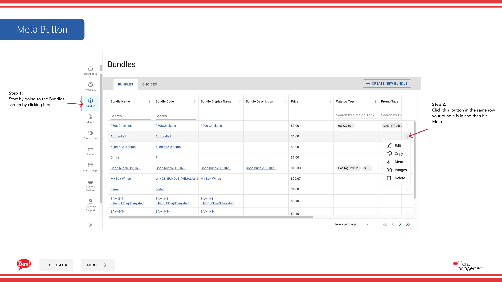

# Añadir Metafields a un Bundle

## Qué cubre esta guía

Adjunta datos personalizados de valor clave a un paquete para las integraciones, el cumplimiento o el seguimiento interno, sólo agregue metafields si su equipo técnico ha especificado claves y valores exactos.

## Pasos

**Step 1:** Navegue a la sección **Bundles** utilizando el menú de navegación de la mano izquierda.

**Step 2:** Encontrar el paquete que desea añadir metafields a la búsqueda por Bundle Name, Bundle Code, Catalog Tags, o Promo Tags.

**Step 3:** Haga clic en el botón ****** (menú de tres puntos) en la misma fila que el paquete, luego seleccione **Meta**.

**Step 4:** Un cajón se abre con dos secciones: **Metafields públicos** y **Metafields privados**. Puedes añadir cualquiera o ambos.

**Para los Metafields públicos (visibles a las integraciones):**

**Step 5:** Haga clic en **Añadir Metafield** en la sección Metafields públicos.

**Step 6:** Rellene los pares de valor clave:
- **Key**: El nombre del campo de metadatos (por ejemplo,`external_id`, `supplier_code`)
- ** Valor**: El valor correspondiente (por ejemplo,`12345`)

Haga clic en **Añadir Metafield** para confirmar.

**Para los Metafields Privados (uso interno solamente):**

**Step 7:** Haga clic en **Añadir Metafield** en la sección de Metafields privados.

**Step 8:** Rellene los pares de valor clave usando el mismo formato que arriba.

Haga clic en **Añadir Metafield** para confirmar.

**Step 9:** Una vez que se añadan todos los metacampos, haga clic en **Guardar** para cometer los cambios.

:::caution
Sólo agregue metafields si su equipo técnico ha especificado las claves y valores exactos necesarios para las integraciones o el cumplimiento. Los metacampos incorrectos pueden romper las integraciones.
:::

:::
Puede agregar múltiples metacampos públicos y privados. Usted no es requerido para añadir ambos — elegir sólo lo que su sistema necesita.
:::

## Guías relacionadas

- [Crear un Bundle](/docs/admin-portal-guide/bundles/create-a-bundle/)
- [Editar un Bundle](/docs/admin-portal-guide/bundles/edit-a-bundle/)

---

*Part of the[Guía del Portal de Admin](/docs/admin-portal-guide)· Sección: Agrupaciones*