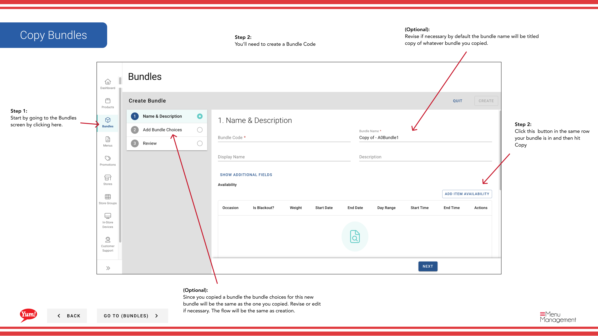

# Copiar un Bundle

## Qué cubre esta guía

Duplica un paquete existente para crear rápidamente ofertas similares con las mismas opciones y configuración.

## Pasos

**Step 1:** Navegue a la sección **Bundles** utilizando el menú de navegación de la mano izquierda.

**Step 2:** Encuentra el paquete que quieres copiar buscando por Bundle Name, Bundle Code, Catalog Tags, o Promo Tags.

**Step 3:** Haga clic en el botón ****** (menú de tres puntos) en la misma fila que el paquete, luego seleccione **Copiar**.

**Step 4:** Un formulario se abre para crear el nuevo paquete. Ingrese un código **Bundle** (requerido).

**Step 5:** Ajuste el **Bundle Name** si es necesario. Por defecto, será "Copy of [Original Name]" — usted puede cambiar esto a algo más descriptivo.

**Step 6:** Revise todos los demás campos (Descripción, Opciones, etc.). El paquete copiado incluye todas las opciones del original. Modifique cualquier campo según sea necesario.

**Step 7:** Haga clic en **Crear** para terminar de copiar el paquete.

:::
El paquete copiado hereda todas las opciones y configuración del original. Puede editar cualquiera de estos detalles antes o después de la creación.
:::

## Guías relacionadas

- [Crear un Bundle](/docs/admin-portal-guide/bundles/create-a-bundle/)
- [Editar un Bundle](/docs/admin-portal-guide/bundles/edit-a-bundle/)

---

*Part of the[Guía del Portal de Admin](/docs/admin-portal-guide)· Sección: Agrupaciones*