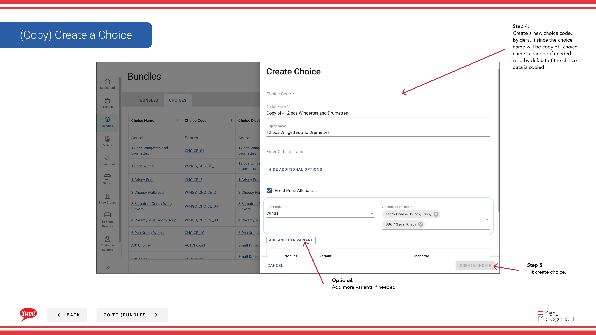

# Copiar una Elección

## Qué cubre esta guía

Duplica una opción existente para crear rápidamente ranuras de selección similares para otros paquetes.

## Pasos

**Step 1:** Navegue a la sección **Bundles** utilizando el menú de navegación de la mano izquierda.

**Step 2:** Haga clic en la pestaña **Choices** en la parte superior de la pantalla Bundles.

**Step 3:** Busque la opción que desee copiar buscando por el nombre de la elección, Código de elección, Nombre de la pantalla de elección o Etiquetas del catálogo.

**Step 4:** Haga clic en el botón ****** (menú de tres puntos) en la misma fila que la opción, luego seleccione **Copiar**.

**Step 5:** Un formulario se abre para crear la nueva opción. Usted debe entrar en un único **Choice Code**.

**Step 6:** Ajusta el ** Nombre de la oficina** si es necesario. Por defecto, será “Copy of [Original Name]” — actualice esto a algo descriptivo.

**Step 7:** Revise todos los demás campos (Min/Max Cantidad, Productos, Variedades, etc.). Todos los ajustes de la opción original son heredados. Modificar según sea necesario.

**Step 8:** Haga clic en **Crear elección** para terminar de crear la opción duplicada.

:::
La opción copiada incluye todos los productos y variantes del original. Usted puede modificar estos antes o después de la creación.
:::

## Guías relacionadas

- [Crear una elección](/docs/admin-portal-guide/bundles/create-a-choice/)
- [Editar una elección](/docs/admin-portal-guide/bundles/edit-a-choice/)
- [Eliminar una elección](/docs/admin-portal-guide/bundles/delete-a-choice/)

---

*Part of the[Guía del Portal de Admin](/docs/admin-portal-guide)· Sección: Agrupaciones*