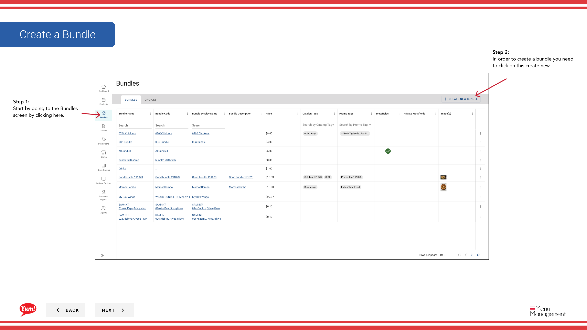

# Crear un Bundle

## Qué cubre esta guía

Construye un acuerdo de combo o comida agrupando productos junto con un solo objeto de compra, con su propio código, precios e información de visualización.

## Pasos

**Step 1:** Navegue a la sección **Bundles** utilizando el menú de navegación de la mano izquierda.

**Step 2:** Haga clic en el botón **+ Crear nuevo paquete**.

**Step 3:** Rellene los detalles del paquete en la página 1. Se requieren campos marcados con *.

| Campo | Qué entrar | Notas |
|-------|--------------|-------|
| * Código de Bundle* | Unico identificador del sistema | Use letras mayúsculas, números e hifénes — por ejemplo,`BUNDLE-3PC-MEAL` |
| **Bundle Name** | Nombre de visualización mostrado a los clientes | por ejemplo, “3-Piece Meal” |
| *Nombre del juego* | Etiquetas más cortas para pantallas de espacio limitado | Defaults to Bundle Name if left blank |
| **Descripción** | Descripción del paquete al cliente | Mantenlo atractivo y claro |

:::
Haga clic en el botón **Añadir detalles** (o “...”) para añadir información opcional como Información Nutricional, un identificador de paquete, Etiquetas de catálogo, y Promo Tags.
:::

:::
Haga clic en el cajón de disponibilidad ** item para establecer ventanas de disponibilidad (por ejemplo, “Lunch 11am–3pm”) cuando este paquete debe ser ordenado.
:::

**Step 4:** Haga clic en **Siguiente** o seleccione el siguiente nivel de paso en la parte superior para proceder a la página 2 — Opciones.

**Step 5:** Añade opciones a tu paquete. Una opción es una ranura de selección (por ejemplo, “Elige tu lado”).

- Para añadir una opción **existente**: Haga clic en **Añadir opción existente**. Un cajón de búsqueda abre — escriba a buscar y haga clic en la opción para seleccionarlo, luego haga clic en **Añadir**.
- Para crear un **nuevo inline de elección**: Haga clic en **Crear una nueva elección** y llenar los campos:

| Campo | Qué entrar | Notas |
|-------|--------------|-------|
| * Código de Justicia* | Unico identificador | por ejemplo,`CHOICE-SIDE` |
| ** Nombre de la oficina** | Label mostrada a clientes | por ejemplo, “Elige tu lado”, “Selecciona tu bebida” |
| *Min Quantity* | Selección mínima requerida | Set to`0`para hacer la elección opcional |
| **Max Quantity** | Máximas selecciones permitidas | por ejemplo,`1`para una elección única |
| **Productos** | Artículos disponibles dentro de esta elección | Buscar y añadir de la lista de productos |

**Step 6:** Haga clic en **Siguiente** para proceder a la página 3 — Comentario.

**Step 7:** Revise todos los detalles introducidos. Haga clic en cualquier encabezado de sección azul para saltar y hacer correcciones. Haga clic en **Crear** para finalizar el paquete.

:::caution
Clicking **Cancel** en cualquier momento descarta toda la información no salvada.
:::

## Guías relacionadas

- [Añadir una imagen a un Bundle](/docs/admin-portal-guide/bundles/add-an-image-to-a-bundle/)
- [Editar un Bundle](/docs/admin-portal-guide/bundles/edit-a-bundle/)
- [Copiar un Bundle](/docs/admin-portal-guide/bundles/copy-a-bundle/)

---

*Part of the[Guía del Portal de Admin](/docs/admin-portal-guide)· Sección: Agrupaciones*