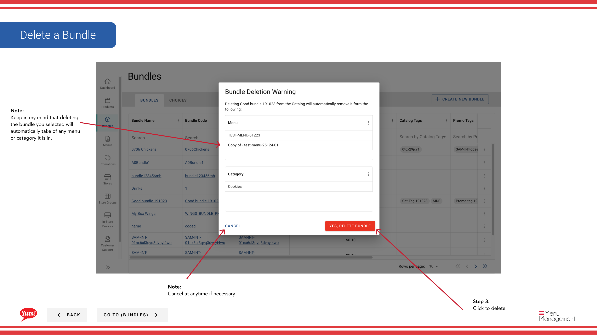

# Borrar un Bundle

## Qué cubre esta guía

Elimina permanentemente un paquete del catálogo y todos los menús donde se le asigna.

## Pasos

**Step 1:** Navegue a la sección **Bundles** utilizando el menú de navegación de la mano izquierda.

**Step 2:** Encuentra el paquete que quieres eliminar buscando por Bundle Name, Bundle Code, Catalog Tags, o Promo Tags.

**Step 3:** Haga clic en el botón ****** (menú de tres puntos) en la misma fila que el paquete, luego seleccione **Delete**.

**Step 4:** Una confirmación modal parece pedirle que confirme la eliminación. Haga clic en **Confirm** para eliminar el paquete, o haga clic fuera del modal o **Cancel** para mantenerlo.

:::caution
Esta acción es permanente. Eliminar un paquete lo eliminará automáticamente de todos los menús y categorías donde se le asigna. No puedes deshacer esta acción.
:::

## Guías relacionadas

- [Crear un Bundle](/docs/admin-portal-guide/bundles/create-a-bundle/)
- [Editar un Bundle](/docs/admin-portal-guide/bundles/edit-a-bundle/)

---

*Part of the[Guía del Portal de Admin](/docs/admin-portal-guide)· Sección: Agrupaciones*