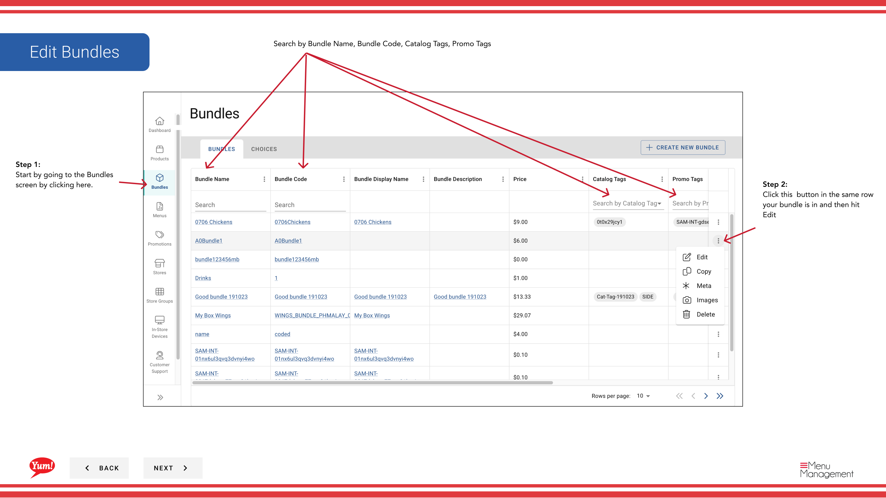

# Editar un Bundle

## Qué cubre esta guía

Actualiza el nombre, código, opciones, precios o descripción de un paquete existente.

## Pasos

**Step 1:** Navegue a la sección **Bundles** utilizando el menú de navegación de la mano izquierda.

**Step 2:** Encuentra el paquete que quieres editar. Usted puede buscar utilizando la barra de búsqueda por Bundle Name, Bundle Code, Catalog Tags, o Promo Tags.

**Step 3:** Haga clic en el botón ****** (menú de tres puntos) en la misma fila que el paquete, luego seleccione **Editar**.

**Step 4:** El mismo formulario multipágina de la creación del paquete se abre. Actualizar cualquier campo:
- Haga clic en los encabezados de sección azul para saltar entre las páginas (Información básica, Opciones, Revisión)
- Haga clic en **Siguiente** para pasar por páginas secuencialmente

**Step 5:** Después de hacer todos los cambios, haga clic en **Guardar** para activar las actualizaciones.

:::caution
Clicking **Cancel** descarta todos los cambios sin salvar.
:::

## Guías relacionadas

- [Crear un Bundle](/docs/admin-portal-guide/bundles/create-a-bundle/)
- [Copiar un Bundle](/docs/admin-portal-guide/bundles/copy-a-bundle/)

---

*Part of the[Guía del Portal de Admin](/docs/admin-portal-guide)· Sección: Agrupaciones*