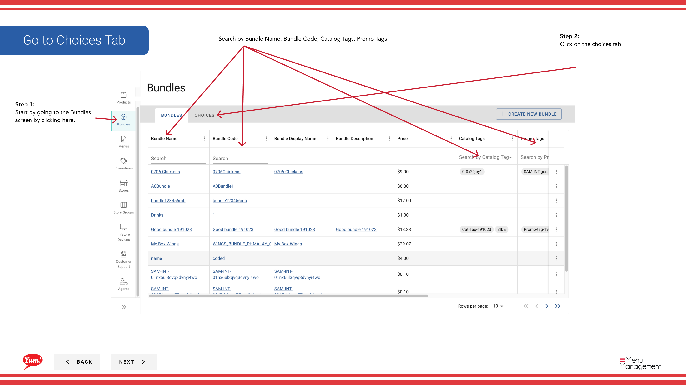
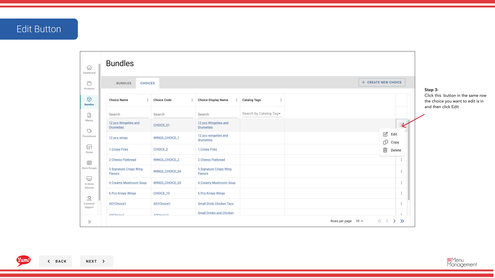

# Editar una elección

## Qué cubre esta guía

Actualiza el nombre, los productos, las variantes o la cantidad min/max.

## Pasos

**Step 1:** Navegue a la sección **Bundles** utilizando el menú de navegación de la mano izquierda.

**Step 2:** Haga clic en la pestaña **Choices** en la parte superior de la pantalla Bundles.

**Step 3:** Encuentra la opción que quieres editar. Puede buscar por Nombre de Elección, Código de Elección, Nombre de Pantalla de Elección o Etiquetas del Catálogo.

**Step 4:** Haga clic en el botón ****** (menú de tres puntos) en la misma fila que la opción, luego seleccione **Editar**.

**Step 5:** Actualizar cualquiera de los siguientes campos:
- **Choice Name** o **Choice Display Name**
- **Min Cantidad** o **Max Cantidad**
- **Productos**: Agregar o eliminar productos y sus variantes

**Step 6:** Haga clic en **Guardar** para cometer sus cambios.

:::
Puede agregar o eliminar productos y variantes en cualquier momento sin afectar los paquetes que utilizan esta opción.
:::

## Guías relacionadas

- [Crear una elección](/docs/admin-portal-guide/bundles/create-a-choice/)
- [Copiar una Elección](/docs/admin-portal-guide/bundles/copy-a-choice/)
- [Eliminar una elección](/docs/admin-portal-guide/bundles/delete-a-choice/)

---

*Part of the[Guía del Portal de Admin](/docs/admin-portal-guide)· Sección: Agrupaciones*