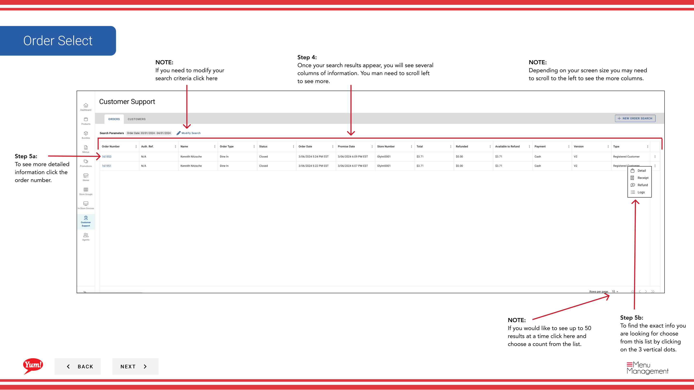
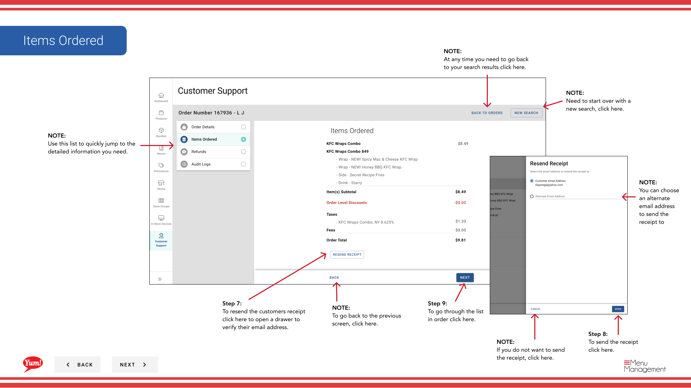
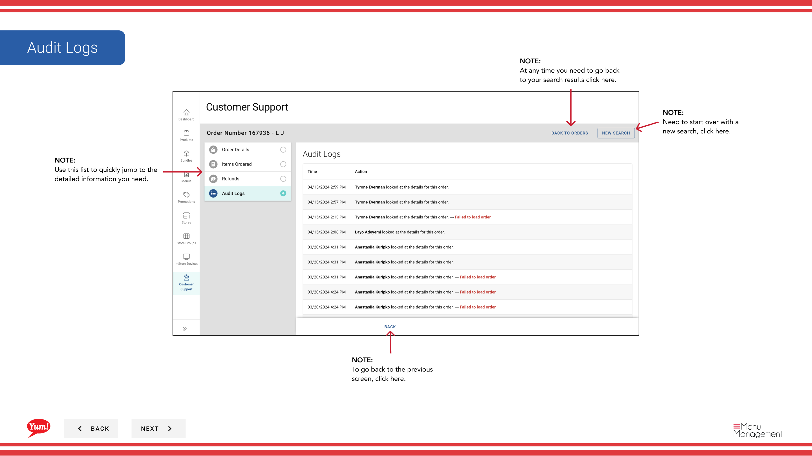

# Búsqueda de orden

## Qué cubre esta guía

Encuentra una orden de cliente específica usando filtros como ID de pedido, fecha o nombre del cliente: la herramienta principal para los agentes de soporte que investigan cuestiones de pedido, emitiendo reembolsos o reenviando recibos.

## Pasos

**Step 1:** Navegue a la sección **Apoyo al cliente** utilizando el menú de navegación de la izquierda.

**Step 2:** Llene el mayor número posible de campos de búsqueda para reducir sus resultados:

| Sección | Campos | Notas |
|---------|--------|-------|
| **Información general** | ID del pedido, Fecha del pedido, Tienda, Estado del pedido | El ID de orden es el más preciso — utilizarlo si está disponible. |
| **Dirección de animación** | Street, City, Postcode | Uso para filtrar por ubicación de entrega. |
| **Información del cliente** | Nombre del cliente, Dirección de correo electrónico, número de teléfono | Rellene su nombre, apellido o ambos. |

Cuantos más campos llenas, más exactos tus resultados.

**Step 3:** Haga clic en **Buscar** para revelar sus resultados.

**Step 4:** Sus resultados de búsqueda aparecen en una tabla con columnas de información de orden. Es posible que necesite desplazarse a la izquierda o a la derecha para ver todas las columnas. Utilice el ****** (menú de tres puntos) en el encabezado de resultados para mostrar o ocultar columnas específicas.

**Step 5:** Haga clic en el ** Número de pedido** para abrir la vista completa del detalle del pedido con toda la información de transacción.

## Resending Receipts

**Step 6:** Desde la vista de detalles del pedido, haga clic en el icono **receipt** o vaya a la opción de recepción en el menú.

**Step 7:** Se abre un cajón. Verifique la dirección de correo electrónico del cliente o introduzca un correo electrónico alternativo si es necesario.

**Step 8:** Haga clic en **Enviar** para enviar el recibo al cliente.

:::
Usted puede enviar recibos a una dirección de correo electrónico alternativa si el correo electrónico registrado del cliente es incorrecto o anticuado.
:::

## Issuing Refunds

**Step 9:** Desde la vista de detalles del pedido, haga clic en el icono **reembolso** o vaya a la opción de reembolso.

**Step 10:** Seleccione el tipo de reembolso:

| Opción | Qué hacer |
|--------|-----------|
| *Reembolso total* | Reembolso del importe total del pedido |
| Reembolso parcial** | Reembolso sólo parte del pedido — usted introducirá la cantidad para el reembolso |

**Step 11:** Seleccione una razón **Reembolso** del desplegamiento (requerido):

| Razón | Cuándo utilizar |
|--------|------------|
| Error de orden | El orden fue colocado incorrectamente |
| Artículos perdidos | Faltaban artículos entregados del orden |
| Denuncia de cliente | El cliente no está satisfecho por otras razones |
| Otros | Para cuestiones no abarcadas |

**Step 12:** Si emite un **Reembolso parcial**, introduzca el importe de la devolución en el campo **Reembolso Cantidad**.

**Step 13:** Haga clic en **Reembolso de la isla** una vez que el botón se activa (todos los campos requeridos).

:::caution
Los reembolsos son permanentes. Una vez emitido, el método de pago del cliente será acreditado. Verifique la razón y la cantidad antes de hacer clic en **Reembolso de ingresos**.
:::

## Consejos de navegación

:::note
En pantallas más pequeñas, las secciones "Delivery Address" y "Customer Information" pueden no ser visibles por defecto. Desplazarse hacia abajo o haga clic en los encabezados de la sección para ampliarlos.
:::

:::note
Si necesita ajustar su búsqueda, haga clic en **Form de inicio** para limpiar todos los campos y comenzar de nuevo.
:::

:::note
Para cambiar la pantalla de resultados, haga clic en el menú ****** (pantalla de tres puntos) en el encabezado de resultados para mostrar/hierrar columnas o ajustar los resultados por página (hasta 50).
:::

## Guías relacionadas

- [Búsqueda de clientes](/docs/admin-portal-guide/customer-support/customer-search/)

---

*Part of the[Guía del Portal de Admin](/docs/admin-portal-guide)· Sección: Atención al cliente*