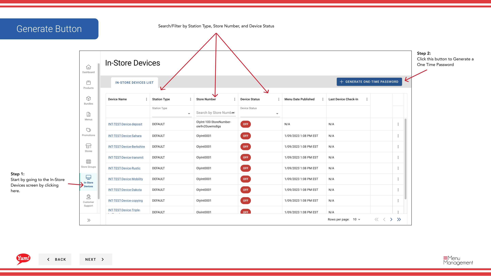
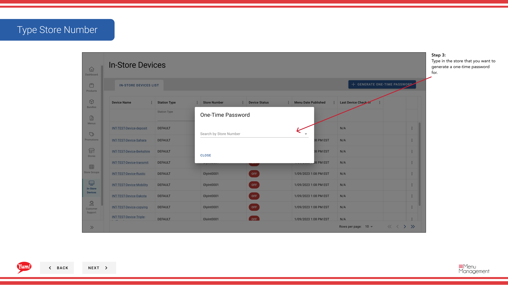

# Generar contraseña de un tiempo

## Qué cubre esta guía

Crea un código de autenticación temporal para un terminal o quiosco POS, utilizado durante la configuración inicial del dispositivo o cuando vuelva a actualizar un dispositivo existente.

:::note Byte POS Caveat
Este flujo de trabajo supone que el dispositivo es parte de una configuración **Byte POS** gestionada a través de Admin Portal.

Si el mercado no está utilizando Byte POS, Byte Commerce se basa en **Byte Connect** como puente al mercado POS, por lo que el flujo de autenticación/ajuste puede no coincidir con los pasos en esta página.
:::

## Pasos

**Step 1:** Navegue a la sección **In-Store Devices** utilizando el menú de navegación de la mano izquierda.

**Step 2:** Haga clic en el botón **Generar contraseña de un tiempo**.

**Step 3:** Un campo de búsqueda aparece. Escriba el número **store** o **store name** para encontrar la ubicación que desea generar una contraseña para.

**Step 4:** Seleccione la tienda de los resultados desplegables. La contraseña única se genera automáticamente y se muestra en pantalla.

**Step 5:** Copia la contraseña de una sola vez (OTP) mostrada. Proporcione este código a la persona que establezca o vuelva a actualizar el dispositivo POS. Entrarán en este código en la pantalla del dispositivo para completar la autentificación.

:::caution
La contraseña única es temporal y expira después de un período establecido (normalmente 15-30 minutos). Si el dispositivo no acepta el código, genera uno nuevo.
:::

:::
Puede buscar y filtrar dispositivos por tipo estación, número de tienda y estado del dispositivo para encontrar la ubicación correcta rápidamente.
:::

## Guías relacionadas

- [Ver detalles del dispositivo dentro de la página](/docs/admin-portal-guide/in-store-devices/view-in-store-device-details/)
- [Desactivar In-Store](/docs/admin-portal-guide/in-store-devices/deactivate-in-store/)
- [Byte Connect](/docs/byte-capabilities/enablement/byte-connect)

---

*Part of the[Guía del Portal de Admin](/docs/admin-portal-guide)· Sección: Dispositivos In-Store*
