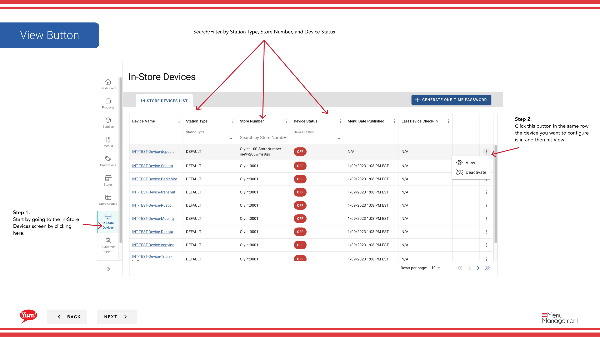

# Ver detalles del dispositivo dentro de la página

## Qué cubre esta guía

Muestra la información completa para un terminal o quiosco POS, incluyendo el nombre de dispositivo, tipo, estado y el historial de publicación de menús, utilizado para la auditoría de dispositivos y la solución de problemas.

:::note Byte POS Caveat
Esta vista de detalle de dispositivo está escrita para **Byte POS** administración de dispositivos en Admin Portal.

Si el mercado no está en Byte POS, **Byte Connect** es el puente entre Byte Commerce y el mercado POS, y la visibilidad del dispositivo o el flujo de trabajo de soporte puede diferir de lo que se muestra aquí.
:::

## Pasos

**Step 1:** Navegue a la sección **In-Store Devices** utilizando el menú de navegación de la mano izquierda.

**Step 2:** Encuentra el dispositivo que quieres ver. Puede buscar o filtrar por tipo de estación, número de tienda o estado del dispositivo.

**Step 3:** Haga clic en el botón ****** (menú de tres puntos) en la misma fila que el dispositivo, luego seleccione **Ver**.

**Step 4:** El panel de detalles del dispositivo se abre, mostrando la siguiente información:

| Campo | Lo que muestra |
|-------|--------------|
| ** Nombre del dispositivo** | Nombre/identificador del dispositivo |
| ** Tipo de estación** | Tipo de dispositivo (por ejemplo, POS Terminal, Kiosk) |
| ** Estado del dispositivo** | Activo o Inactivo |
| **Menu Publish Date** | Cuando la última actualización del menú fue enviada a este dispositivo |
| **Última entrada de dispositivos** | Cuando el dispositivo se comunica por última vez con Atlas |

**Step 5:** Revisa los detalles del dispositivo. Utilice esta información para verificar que el dispositivo está activo y recibir actualizaciones de menú correctamente. Si **Last Device Check-In** es viejo (más de un día o dos), el dispositivo puede tener problemas de conectividad.

:::
Compruebe el **Estado del dispositivo** para confirmar que el dispositivo está activo. Un dispositivo inactivo no recibirá actualizaciones de menú o órdenes de proceso.
:::

## Guías relacionadas

- [Generar contraseña de un tiempo](/docs/admin-portal-guide/in-store-devices/generate-one-time-password/)
- [Desactivar In-Store](/docs/admin-portal-guide/in-store-devices/deactivate-in-store/)
- [Byte Connect](/docs/byte-capabilities/enablement/byte-connect)

---

*Part of the[Guía del Portal de Admin](/docs/admin-portal-guide)· Sección: Dispositivos In-Store*
