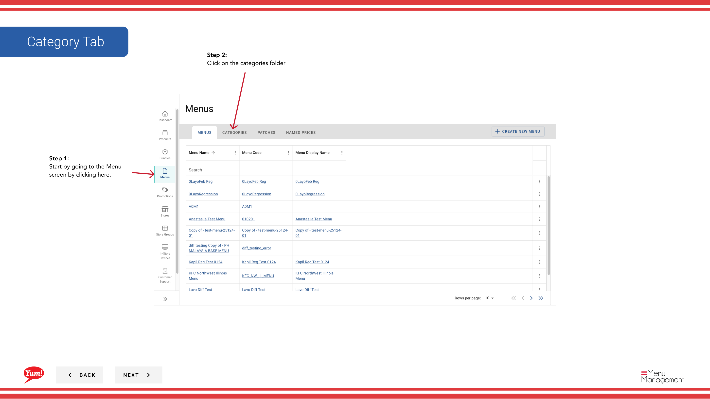

# Añadir Metafields a una categoría

## Qué cubre esta guía

Adjunta datos personalizados de valor clave a una categoría para la integración con sistemas externos o requisitos específicos del mercado. Sólo agregue metafields si su equipo técnico ha especificado las claves y los valores exactos necesarios.

## Pasos

**Step 1:** Navegue a la sección **Menus** usando el menú de navegación de la mano izquierda.

**Step 2:** Haga clic en la carpeta **Categorías** para ver todas las categorías.

**Step 3:** Busque la categoría que desea añadir metafields, haga clic en el menú **action** (tres puntos) en la misma fila, y seleccione **Meta**.

**Step 4:** Haga clic en el botón **Añadir Metafield** para abrir el formulario de entrada de metafield.

**Step 5:** Rellene los detalles de metafield:

| Campo | Qué entrar | Notas |
|-------|--------------|-------|
| *Key* | El nombre del campo según lo requerido por su integración | por ejemplo,`display_order`, `region`, `supplier_id`Pregúntele a su equipo técnico por nombres de clave exactos. |
| *Valor* | El valor de los datos para esta clave | por ejemplo,`1`, `APAC`, `SUP-12345`. Debe coincidir con el formato esperado por su integración. |
| *Tipo* | Público o Privado | **Public**: Visible a las integraciones externas. **Privada**: Visible sólo a su equipo. |

Haga clic en **Añadir Metafield** para guardar esta entrada.

**Step 6:** Para añadir más metacampos, repita **Paso 4-5** para cada par de valor clave necesario.

**Step 7:** Una vez que haya añadido todos los campos necesarios, haga clic en **Guardar** o **Cerrar** para confirmar y aplicar los cambios en la categoría.

:::caution
Sólo agregue metafields si su equipo técnico ha especificado las claves y los valores exactos a utilizar. Los metacampos incorrectos pueden romper las integraciones o causar comportamiento inesperado.
:::

## Guías relacionadas

- [Editar una categoría](/docs/admin-portal-guide/menus/edit-a-category/)— Editar otros detalles de la categoría
- [Crear una categoría](/docs/admin-portal-guide/menus/create-a-category/)— Crear una nueva categoría

---

*Part of the[Guía del Portal de Admin](/docs/admin-portal-guide)· Sección: Menús*