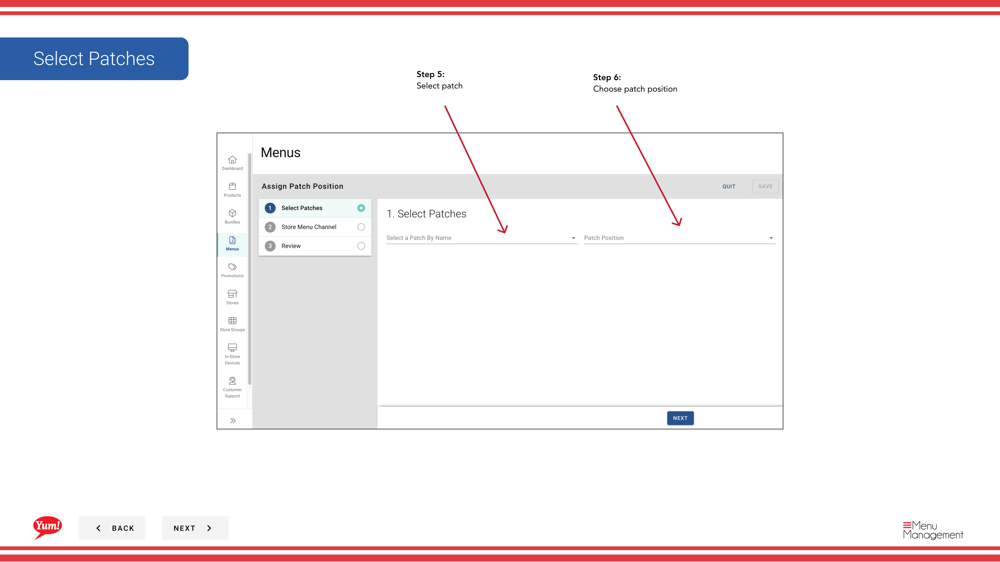

# Asignar un parche (Añadir a la lista de parches)

## Qué cubre esta guía

Añade un parche a la lista de parches activos de una tienda sin eliminar los parches existentes. Los parches son aplicados en orden, con cada parche que capa sus overrides en la parte superior del menú base y parches anteriores.

## Pasos

**Step 1:** Navegue a la sección **Menus** usando el menú de navegación de la mano izquierda.

**Step 2:** Haga clic en la pestaña **Patches** para ver todos los parches.

**Step 3:** Haga clic en el botón **Crear nuevo** para comenzar una nueva asignación de parches.

**Step 4:** Seleccione **Añadir parche a lista** para añadir un parche a las listas de parches existentes.

**Step 5:** Seleccione el **Patch** que desea asignar desde el desplegable.

| Campo | Qué entrar | Notas |
|-------|--------------|-------|
| *Patch* | Seleccione de la lista de parches disponibles | Elija el parche con las anulas que desea aplicar. |

**Step 6:** Elija la posición **Patch** en la lista. Los parches se aplican en orden, por lo que importa la posición si varios parches apuntan a los mismos elementos.

| Campo | Qué entrar | Notas |
|-------|--------------|-------|
| *Position* | Seleccione dónde en la lista de parches para añadir este parche | "Primero" aplica este parche antes que otros, "Último" lo aplica después. Elija basado en la prioridad de sus anulas. |

**Step 7:** Seleccione el **Channel** donde se aplica esta asignación de parches.

| Campo | Qué entrar | Notas |
|-------|--------------|-------|
| *Channel* | Seleccione el canal de pedido | por ejemplo, "Web", "Mobile", "Delivery Platform". El parche sólo se aplicará en el canal seleccionado. |

**Step 8:** Seleccione los **Stores** que recibirán este parche.

| Campo | Qué entrar | Notas |
|-------|--------------|-------|
| # Tortas # | Seleccione una o más tiendas | Use la búsqueda para encontrar tiendas, o seleccione grupos enteros de tiendas. Sólo las tiendas seleccionadas recibirán este parche. |

**Step 9:** Revise sus selecciones en la página **Summary**, a continuación, haga clic en **Guardar** para añadir el parche a las listas de parches de las tiendas seleccionadas.

:::note
El parche se añade ahora a la lista de parches activos de la tienda. Si la tienda tenía otros parches, este nuevo parche se añade además de ellos basado en la posición que seleccionó.
:::

## Guías relacionadas

- [Assign a Patch (Replace Existing List)](/docs/admin-portal-guide/menus/assign-a-patch-replace-existing-list/)— Reemplazar toda la lista de parches de una tienda
- [Editar un parche](/docs/admin-portal-guide/menus/edit-a-patch/)— Actualizar un parche antes de asignarlo
- [Crear un parche](/docs/admin-portal-guide/menus/create-a-patch/)— Crear un nuevo parche para asignar

---

*Part of the[Guía del Portal de Admin](/docs/admin-portal-guide)· Sección: Menús*