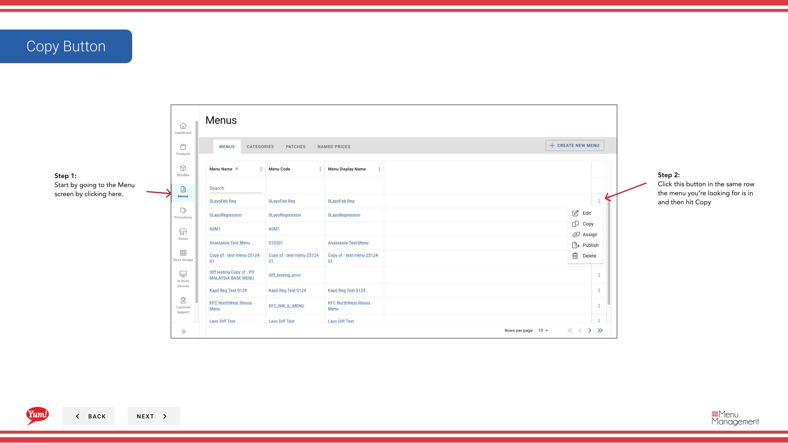

# Copiar un menú

## Qué cubre esta guía

Duplica un menú existente para usar como punto de partida para un nuevo menú, ahorrando tiempo de configuración significativo.

## Pasos

**Step 1:** Navegue a la sección **Menus** usando el menú de navegación de la mano izquierda.

**Step 2:** Busque el menú que desea copiar en la lista de menús, haga clic en el menú **acción** (tres puntos) en la misma fila, y seleccione **Copiar**.

**Step 3:** El formulario de detalles del menú aparecerá. Actualizar los siguientes campos según sea necesario:

| Campo | Qué entrar | Notas |
|-------|--------------|-------|
| *Menu Code* | Un identificador único para el nuevo menú | Use letras mayúsculas, números e hipófisis solamente — por ejemplo,`AU-BREAKFAST-2025`Debe ser diferente del menú original. No se puede cambiar después de la creación. |
| *Menu Name* | Un nombre legible para este menú | por ejemplo, "Australia Breakfast Menu 2025". Se muestra en la lista de menús y al asignar menús a las tiendas. |

Todas las categorías, productos y paquetes del menú original se copian automáticamente.

**Step 4:** Una vez que haya introducido el nuevo código de menú y el nombre, haga clic en **Crear** para guardar el menú copiado.

:::note
El menú copiado tendrá la misma estructura de categoría y elementos como el original. Editarlo después de la creación si necesita hacer cambios.
:::

## Guías relacionadas

- [Editar un menú](/docs/admin-portal-guide/menus/edit-a-menu/)— Modificar el contenido del menú copiado
- [Asignar un menú](/docs/admin-portal-guide/menus/assign-a-menu/)— Asignar el menú copiado a las tiendas y canales

---

*Part of the[Guía del Portal de Admin](/docs/admin-portal-guide)· Sección: Menús*