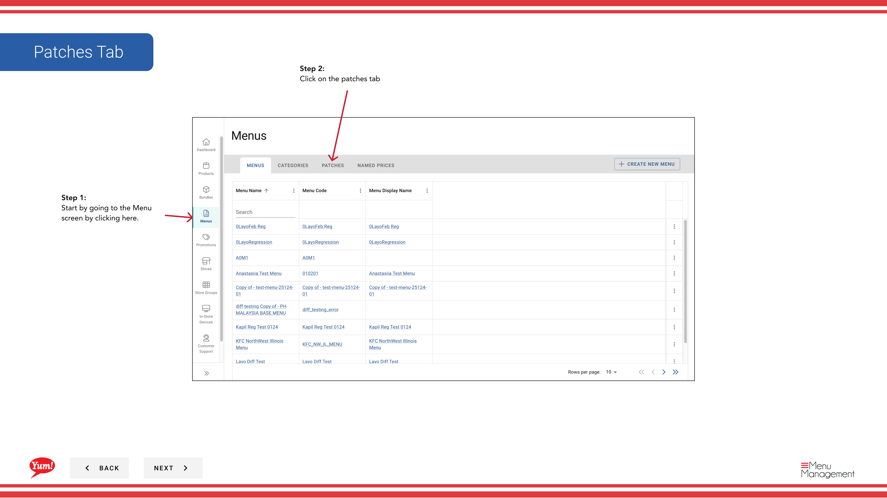

# Crear un parche

## Qué cubre esta guía

Crea un parche de menú: una anulación dirigida que modifique elementos específicos (productos, paquetes o variantes) en un menú sin reemplazar el menú completo. Comúnmente utilizado para los precios localizados o los cambios regionales de disponibilidad.

## Pasos

**Step 1:** Navegue a la sección **Menus** usando el menú de navegación de la mano izquierda.

**Step 2:** Haga clic en la pestaña **Patches** para ver todos los parches.

**Step 3:** Haga clic en el botón **Crear nuevo parche**.

**Step 4:** Introduzca un nombre descriptivo para el parche. Se requieren campos marcados con *.

| Campo | Qué entrar | Notas |
|-------|--------------|-------|
| **Patch Name** | Un nombre descriptivo para lo que este parche cambia | Por ejemplo, “Sydney Q1 Pricing Override”, “Halalal Menu Availability Fix”, “Regional Promo Discount”. Solía identificar el parche en las listas. |

**Step 5:** Seleccione un **Operación** del desplegable. Esto define el tipo de cambio que hará el parche.

| Operación | Propósito |
|-----------|---------|
| Cambio de precio | Cambiar el precio de artículos específicos |
| Disponibilidad Override | Activar o desactivar objetos en ciertos momentos |
| Tema Habilitado/desactivado | Activar o apagar los elementos |
| Otras operaciones personalizadas | Depende de la configuración del sistema |

**Step 6:** Después de seleccionar una operación, haga clic en **Añadir Operación** para proceder.

**Step 7:** Busque y seleccione los productos específicos, variantes o paquetes a los que se aplica esta operación. Una vez que haya seleccionado todos los elementos necesarios, haga clic en **Añadir Operación** para guardarlos.

**Step 8:** Puedes añadir más operaciones al mismo parche repitiendo **Pasos 5–7**. Cada operación permite agrupar los cambios relacionados.

**Step 9:** Una vez que haya añadido todas las operaciones, haga clic en **Crear** para guardar el parche.

:::
Puede agregar múltiples operaciones a un solo parche para hacer cambios relacionados con el paquete. Por ejemplo, puede crear un parche que incluye tanto sobrevaloramientos de precios como cambios de disponibilidad para una promoción regional.
:::

:::note
Los parches todavía no se aplican a las tiendas. Después de crear un parche, debe asignarlo a las tiendas usando las guías “Asignar un parche”.
:::

## Guías relacionadas

- [Editar un parche](/docs/admin-portal-guide/menus/edit-a-patch/)— Actualizar las operaciones o los elementos de un parche
- [Copiar un parche](/docs/admin-portal-guide/menus/copy-a-patch/)— Duplicar un parche como punto de partida
- [Asignar un parche (Añadir a la lista de parches)](/docs/admin-portal-guide/menus/assign-a-patch-add-to-patch-list/)— Añadir este parche a la lista activa de una tienda
- [Eliminar un parche](/docs/admin-portal-guide/menus/delete-a-patch/)- Quitar un parche

---

*Part of the[Guía del Portal de Admin](/docs/admin-portal-guide)· Sección: Menús*