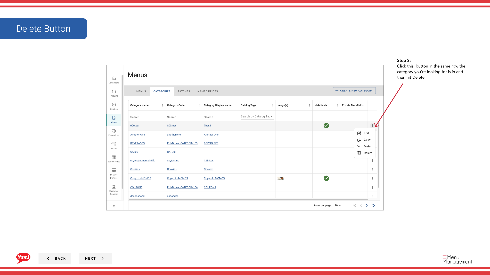
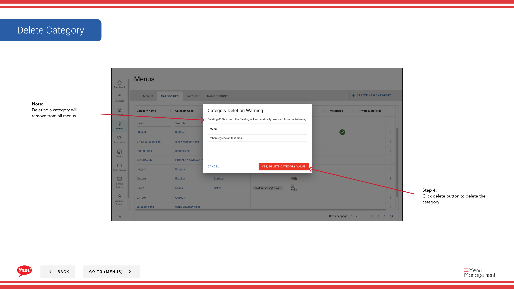

# Suprímase una categoría

## Qué cubre esta guía

Elimina permanentemente una categoría del sistema cuando ya no es necesaria.

## Pasos

**Step 1:** Navegue a la sección **Menus** usando el menú de navegación de la mano izquierda.

**Step 2:** Haga clic en la carpeta **Categorías** para ver todas las categorías.

**Step 3:** Busque la categoría que desee eliminar, haga clic en el menú **action** (tres puntos) en la misma fila, y seleccione **Delete**.

**Step 4:** Aparecerá un diálogo de confirmación. Haga clic en **Delete** para eliminar permanentemente la categoría.

:::caution
Eliminar una categoría lo eliminará de todos los menús que la usen. Los productos previamente en esta categoría no serán asignados y podrán ser reasignados a otras categorías. Esta acción no se puede deshacer.
:::

## Guías relacionadas

- [Crear una categoría](/docs/admin-portal-guide/menus/create-a-category/)— Crear una categoría de reemplazo si es necesario
- [Editar una categoría](/docs/admin-portal-guide/menus/edit-a-category/)— Actualizar el nombre de una categoría si no desea eliminarlo

---

*Part of the[Guía del Portal de Admin](/docs/admin-portal-guide)· Sección: Menús*