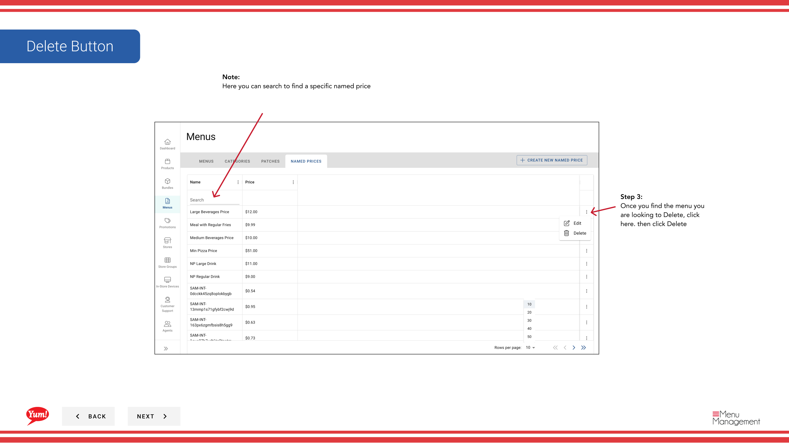

# Precio suprimido

## Qué cubre esta guía

Elimina permanentemente un precio que ya no está en uso. Elimina la etiqueta de precio solamente — los productos que la utilizan deben ser reasignados a un precio diferente.

## Pasos

**Step 1:** Navegue a la sección **Menus** usando el menú de navegación de la mano izquierda.

**Step 2:** Haga clic en la pestaña ** Precios conocidos** para ver todos los precios mencionados.

**Step 3:** Encuentra el precio que quieras eliminar en la lista. Puede utilizar el cuadro de búsqueda para localizarlo o ajustar el número de resultados mostrados por página.

**Step 4:** Haga clic en el menú **action** (tres puntos) en la misma fila, luego seleccione **Eliminar**.

**Step 5:** Aparecerá un diálogo de confirmación. Haga clic en el botón **Delete** para eliminar permanentemente el precio mencionado.

:::caution
Eliminar un precio llamado lo eliminará de todos los productos y variantes que lo utilizan. Los productos tendrán que ser reasignados a un precio diferente o un valor de precio directo. Esta acción no puede ser aprobada. Antes de borrar, considere qué productos están utilizando este precio.
:::

## Guías relacionadas

- [Crear un precio llamado](/docs/admin-portal-guide/menus/create-a-named-price/)— Crear un precio de reemplazo llamado si es necesario
- [Precio Editado](/docs/admin-portal-guide/menus/edit-named-price/)— Actualizar un precio llamado en lugar de eliminarlo

---

*Part of the[Guía del Portal de Admin](/docs/admin-portal-guide)· Sección: Menús*