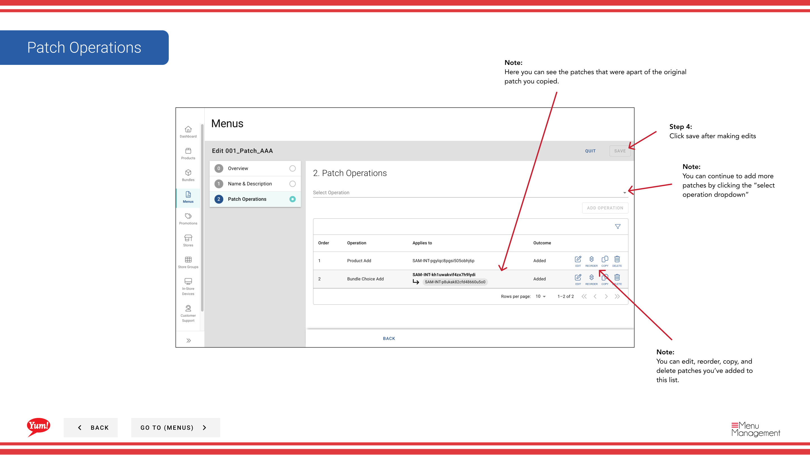

# Editar un parche

## Qué cubre esta guía

Actualiza el nombre, las operaciones o los elementos de un parche existente.

## Pasos

**Step 1:** Navegue a la sección **Menus** usando el menú de navegación de la mano izquierda.

**Step 2:** Haga clic en la pestaña **Patches** para ver todos los parches.

**Step 3:** Busque el parche que desee editar, haga clic en el menú **action** (tres puntos) en la misma fila, y seleccione **Editar**.

**Step 4:** En la pestaña Información general, puede actualizar el nombre del parche.

| Campo | Qué entrar | Notas |
|-------|--------------|-------|
| **Patch Name** | Un nombre descriptivo para lo que este parche cambia | Por ejemplo, “Sydney Q1 Pricing Override”, “Halalal Menu Availability Fix”. Actualizar si el alcance o propósito ha cambiado. |

**Step 5:** Ver y modificar las operaciones en la sección **Operaciones**. Puedes:
- Editar una operación haciendo clic en ella y actualizando los elementos o ajustes
- Operaciones de reordenamiento arrastrando
- Copiar una operación
- Eliminar una operación
- Agregar nuevas operaciones haciendo clic en **Añadir Operación**

**Step 6:** Una vez que haya hecho todos los cambios, haga clic en **Guardar** para aplicarlos.

:::note
Los cambios a un parche sólo afectan a las tiendas donde se asigna activamente. Los parches que aún no están asignados o que han sido eliminados de la lista de parches de una tienda no serán afectados.
:::

## Guías relacionadas

- [Copiar un parche](/docs/admin-portal-guide/menus/copy-a-patch/)- Duplicar este parche
- [Eliminar un parche](/docs/admin-portal-guide/menus/delete-a-patch/)- Quitar este parche
- [Asignar un parche (Añadir a la lista de parches)](/docs/admin-portal-guide/menus/assign-a-patch-add-to-patch-list/)- Asignar este parche a las tiendas

---

*Part of the[Guía del Portal de Admin](/docs/admin-portal-guide)· Sección: Menús*