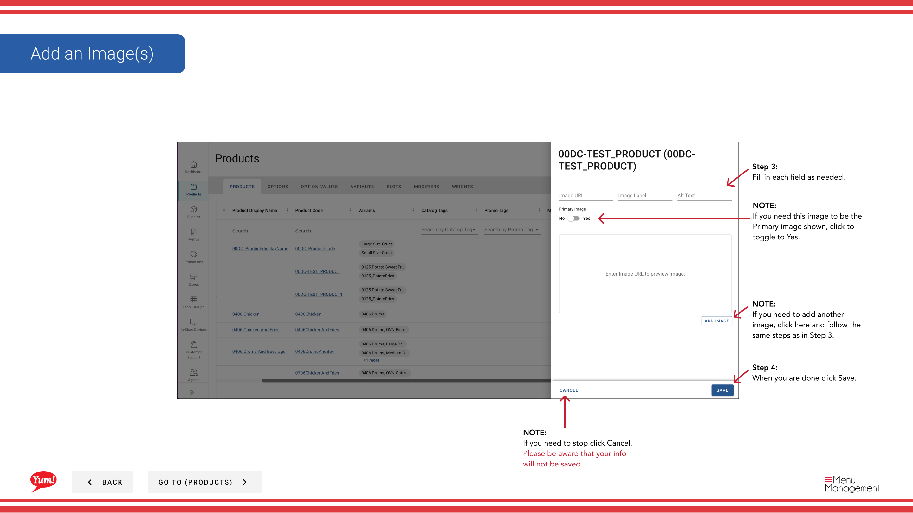

# Añadir una imagen a un producto

## Qué cubre esta guía

Sube y asigna imágenes de visualización a un producto para que los clientes vean visuales precisas al ordenar a través de canales digitales.

## Pasos

**Step 1:** Navegue a la sección **Productos** usando el menú de navegación izquierdo.

**Step 2:** Encuentra el producto al que quieres añadir una imagen. Puede buscar por Nombre del Producto o Código del Producto.

**Step 3:** Haga clic en el menú de tres puntos junto al nombre del producto, a continuación, seleccione **Editar**.

**Step 4:** En el formulario de edición, navega a la sección de la imagen o haga clic en **Siguiente** para alcanzarla. Busque la zona **Imágenes**.

**Step 5:** Haga clic en **Añadir imagen** o el área de carga para seleccionar un archivo de imagen de su computadora.

**Step 6:** Rellene los detalles de la imagen:

| Campo | Qué entrar | Notas |
|-------|--------------|-------|
| **Image Upload** | Haga clic para seleccionar un archivo de imagen | formatos JPG, PNG y WebP son compatibles |
| **Imagen principal** | Toggle to **Sí** si esta es la imagen principal | Sólo una imagen por producto debe ser marcada como primaria |

**Step 7:** Si necesita añadir varias imágenes, haga clic en **Añadir otra imagen** y repetir Pasos 5-6.

**Step 8:** Cuando haya terminado, haga clic en el botón **Guardar**.

## Notas

:::
Toggle **Imagen primaria** a **Sí** para configurar esto como la imagen principal mostrada a los clientes.
:::

:::
Puede añadir varias imágenes a un producto haciendo clic en **Añadir otra imagen**.
:::

:::caution
Clicking **Cancel** descarta todas las adiciones de imagen sin guardar.
:::

---

*Part of the[Guía del Portal de Admin](/docs/admin-portal-guide)· Sección: Productos*