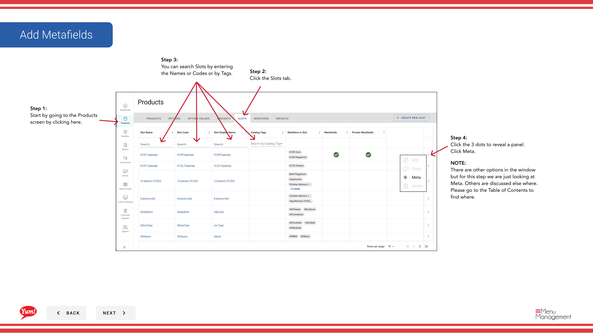
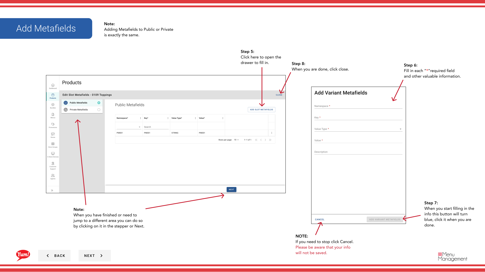
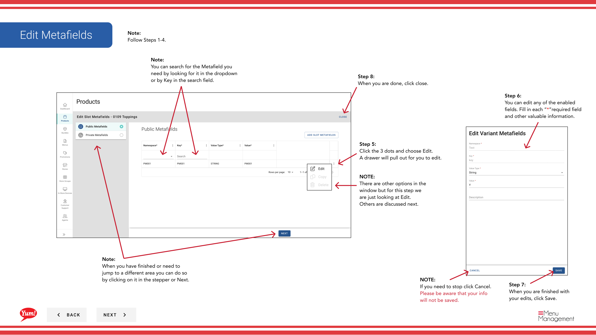
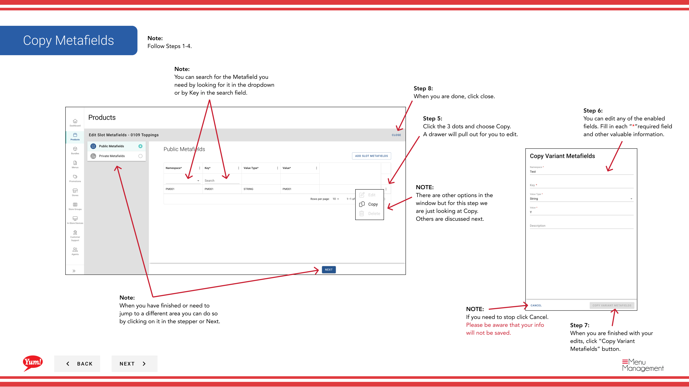

# Añadir Metafields a una Ranura

## Qué cubre esta guía

Adjunta metadatos personalizados a una ranura para las necesidades de integración del sistema o requisitos específicos del mercado.

## Pasos

**Step 1:** Navegue a la sección **Productos** usando el menú de navegación izquierdo.

**Step 2:** Haga clic en la pestaña **Slots**.

**Step 3:** Busque la ranura al entrar en el Nombre de Ranura, Código de Ranura, o Etiqueta en el campo de búsqueda.

**Step 4:** Haga clic en el menú de tres puntos junto a la ranura, luego seleccione **Meta**.

**Step 5:** Un cajón se abrirá mostrando tanto **Public** como **Privada** secciones de metafield.

**Step 6:** Haga clic en el botón **Añadir** para añadir un nuevo metafield.

**Step 7:** Rellene cada metafield con la clave exacta y el valor que su equipo técnico ha especificado.

### Para editar un Metafield existente

**Step 8:** Haga clic en el menú de tres puntos junto al metafield que desea editar, y luego seleccione **Editar**.

**Step 9:** Actualizar la clave y el valor según sea necesario, luego haga clic en **Guardar**.

### Para copiar un Metafield

**Step 10:** Haga clic en el menú de tres puntos junto al metafield que desea copiar, y luego seleccione **Copy**.

**Step 11:** Se creará una nueva entrada de metafield con la misma clave y valor. Editar si es necesario.

### Para eliminar un Metafield

**Step 12:** Haga clic en el menú de tres puntos junto al metafield que desea eliminar, luego seleccione **Eliminar**.

**Step 13:** Haga clic en el botón rojo **Eliminar** para eliminar permanentemente el metafield.

**Step 14:** Cuando haya terminado, haga clic en **Cerrar** para cerrar el cajón.

## Notas

:::caution
Sólo agregue metafields si su equipo técnico ha especificado las claves y los valores exactos a utilizar. Los metacampos incorrectos pueden causar fallas de integración.
:::

:::
Usted puede buscar metafields buscando en el desplegable o escribiendo el nombre clave en el campo de búsqueda.
:::

:::
Agregar metafields a **Public** o **Privado** sigue el mismo proceso.
:::

:::caution
Eliminar un metacampo es permanente. Confirme que está eliminando la entrada correcta antes de hacer clic en Eliminar.
:::

---

*Part of the[Guía del Portal de Admin](/docs/admin-portal-guide)· Sección: Productos*