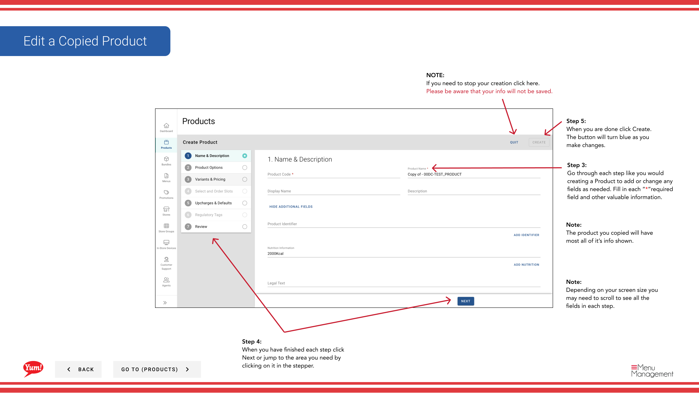

# Copiar un producto

## Qué cubre esta guía

Duplica un producto existente como punto de partida, reduciendo la entrada de datos al crear artículos similares en el catálogo.

## Pasos

**Step 1:** Navegue a la sección **Productos** usando el menú de navegación izquierdo.

**Step 2:** Encuentra el producto que quieres copiar. Puede buscar por Nombre del Producto o Código del Producto.

**Step 3:** Haga clic en el menú de tres puntos junto al nombre del producto, luego seleccione **Copiar**.

**Step 4:** El formulario de copia aparecerá con la mayor parte de la información del producto original ya llenado. Modifique cualquier campo según sea necesario.

**Step 5:** Siga los mismos pasos que crear un nuevo producto. Ir a través de cada página (Basic Information, Options, Variants, Slots, Bulk Actions, Tags, Comentario) haciendo clic en **Siguiente** o saltar directamente a una sección haciendo clic en su encabezado azul.

**Step 6:** Cuando hayas terminado de hacer tus cambios, haz clic en el botón **Crear**. El botón sólo será clicable después de que haya hecho cambios.

## Notas

:::
Puede buscar productos por Nombre del Producto o Código del Producto para encontrar rápidamente el artículo que desea copiar.
:::

:::
Haga clic en los encabezados de sección azul para saltar directamente a la sección que desea modificar en lugar de navegar paso a paso.
:::

:::caution
Clicking **Cancel** descarta todos los cambios sin salvar.
:::

---

*Part of the[Guía del Portal de Admin](/docs/admin-portal-guide)· Sección: Productos*