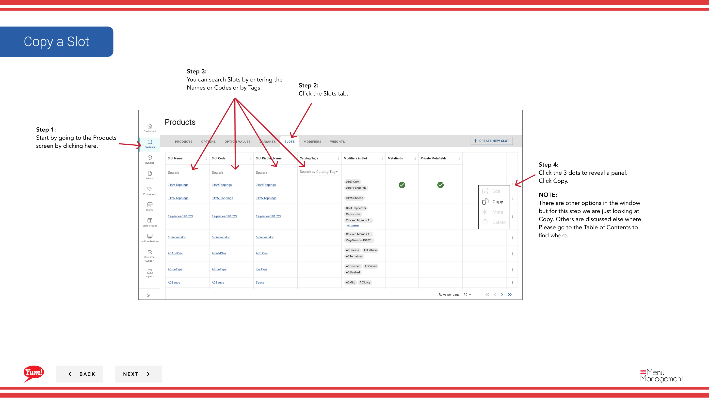

# Copiar una Ranura

## Qué cubre esta guía

Duplica una ranura para acelerar la configuración del producto al crear estructuras de personalización similares.

## Pasos

**Step 1:** Navegue a la sección **Productos** usando el menú de navegación izquierdo.

**Step 2:** Haga clic en la pestaña **Slots**.

**Step 3:** Busque la ranura que desea copiar al entrar en el Nombre de Ranura, Código de Ranura, o Etiqueta en el campo de búsqueda.

**Step 4:** Haga clic en el menú de tres puntos junto a la ranura, a continuación, seleccione **Copiar**.

**Step 5:** El formulario de copia aparecerá con la información original de la ranura. Actualizar los campos según sea necesario. Se requieren campos marcados con *.

| Campo | Qué entrar | Notas |
|-------|--------------|-------|
| * Código de la trama* | Unico identificador para la nueva ranura | Debe ser diferente del original |
| **Slot Name** | Describe lo que la personalización ofrece esta ranura | Puede ser el mismo o personalizado |
| *Min Quantity* | Seleccionamientos mínimos de modificadores requeridos | 0 = opcional |
| **Max Quantity** | Se permiten selecciones de modificador máximo | Leave blank for unlimited |

**Step 6:** Revise todas las secciones (Información básica, Modificadores, Pesos) y haga cualquier cambio necesario.

**Step 7:** Cuando haya revisado sus cambios y esté listo, haga clic en **Crear**.

## Notas

:::caution
El código **Slot** debe ser único. No puede utilizar el mismo código que la ranura original.
:::

:::
Usted puede buscar ranuras por Nombre de Ranura, Código de Ranura, o Tag para encontrar rápidamente el artículo que desea copiar.
:::

:::caution
Clicking **Cancel** descarta todos los cambios sin salvar.
:::

---

*Part of the[Guía del Portal de Admin](/docs/admin-portal-guide)· Sección: Productos*