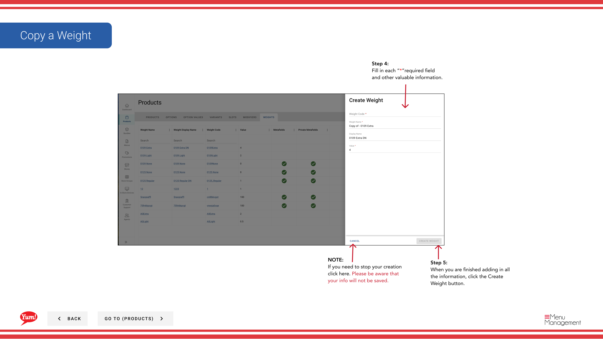

# Copiar un peso

## Qué cubre esta guía

Duplica una entrada de peso para reducir el tiempo de configuración al crear configuraciones de peso similares.

## Pasos

**Step 1:** Navegue a la sección **Productos** usando el menú de navegación izquierdo.

**Step 2:** Haga clic en la pestaña **Pesas**.

**Step 3:** Busque el peso que desee copiar introduciendo el nombre de peso o el código de peso en el campo de búsqueda.

**Step 4:** Haga clic en el menú de tres puntos junto al peso, luego seleccione **Copiar**.

**Step 5:** El formulario de copia aparecerá con la información del peso original. Actualizar los campos según sea necesario. Se requieren campos marcados con *.

| Campo | Qué entrar | Notas |
|-------|--------------|-------|
| * Código de peso* | Identificador único para el nuevo peso | Debe ser diferente del original (por ejemplo, “WT-LARGE-COPY”) |
| *Nombre de peso* | Describe el tamaño de la porción | Puede ser el mismo o personalizado |
| **Max Weight Value** | Valor máximo de peso numérico | por ejemplo, “500” (en gramos o en su unidad) |
| *Default* | Toggle to mark as default | Sólo un peso debe ser marcado como predeterminado por opción |

**Step 6:** Cuando termine de añadir toda la información, haga clic en el botón **Crear Peso**.

## Notas

:::caution
El ** Código de Peso** debe ser único. No puede utilizar el mismo código que el peso original.
:::

:::caution
Clicking **Cancel** descarta todos los cambios sin salvar.
:::

:::
Puede buscar pesos por nombre de peso o código de peso.
:::

---

*Part of the[Guía del Portal de Admin](/docs/admin-portal-guide)· Sección: Productos*