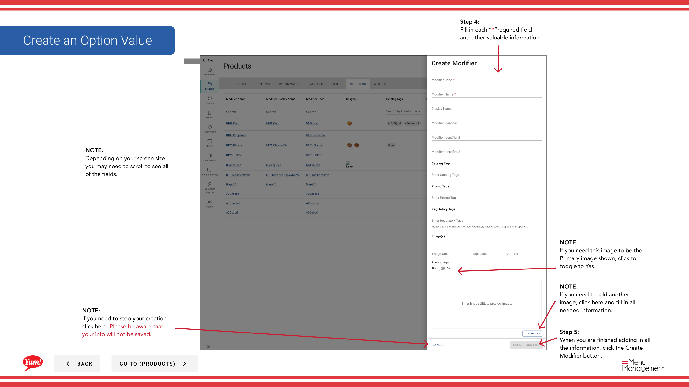

# Crear un Modificador

## Qué cubre esta guía

Crea un elemento adicional o de personalización (por ejemplo, “Extra Cheese”) que puede vincularse con productos a través de ranuras, permitiendo a los clientes personalizar su pedido con actualizaciones opcionales o requeridas.

## Pasos

**Step 1:** Navegue a la sección **Productos** usando el menú de navegación izquierdo.

**Step 2:** Haga clic en la pestaña **Modificadores**.

**Step 3:** Haga clic en el botón **+ Crear nuevo modificador**.

**Step 4:** Rellene los detalles del modificador. Se requieren campos marcados con *.

| Campo | Qué entrar | Notas |
|-------|--------------|-------|
| * Código modificador* | Identificador único para este modificador | Use letras mayúsculas, números e hifénes (por ejemplo, “MOD-EXTRA-CHEESE”) |
| ** Nombre del modificador** | Nombre mostrado a los clientes en los canales de pedidos | por ejemplo, “Extra Cheese”, “No Pickles”, “Extra Sauce” |
| *Precio* | Cargo adicional para seleccionar este modificador | Entra`0`si no hay cargo extra |
| **Imagen* | Imagen opcional para este modificador | Toggle **Primary Image** a Sí para establecer como imagen de pantalla principal. Haga clic en **Añadir otra imagen** para añadir más. |

**Step 5:** Cuando termine de añadir toda la información, haga clic en el botón **Crear Modificador**.

## Notas

:::caution
Clicking **Cancel** descarta toda la información no salvada.
:::

:::
Si este modificador será la imagen primaria mostrada, recuerde cambiar **Imagen primaria** a **Sí** después de subir.
:::

:::
Puede añadir varias imágenes haciendo clic en **Añadir otra imagen**.
:::

---

*Part of the[Guía del Portal de Admin](/docs/admin-portal-guide)· Sección: Productos*