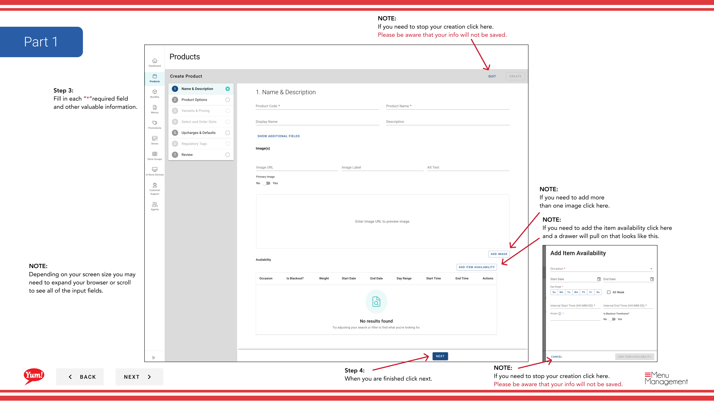
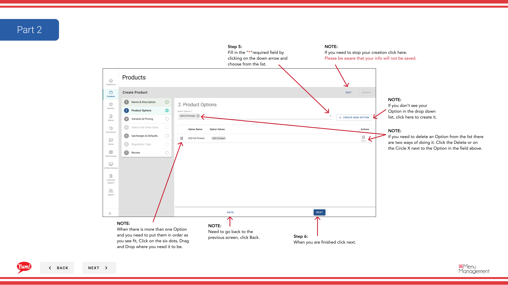
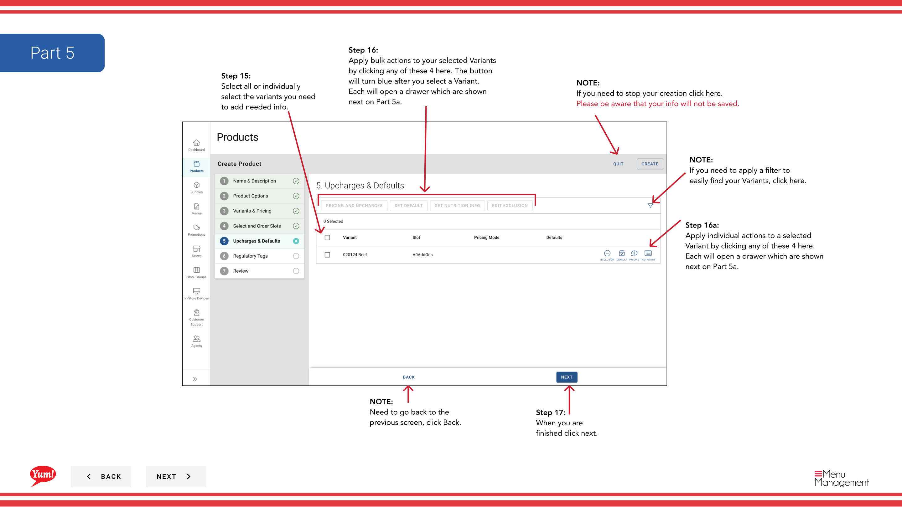

# Crear un producto

## Qué cubre esta guía

Construye un producto completo desde cero, definiendo su código, nombre, variantes, opciones, precios, ranuras, modificadores y ventanas de disponibilidad para que esté listo para vender a través de canales digitales.

## Pasos

### Página 1: Información básica sobre productos

**Step 1:** Navegue a la sección **Productos** usando el menú de navegación izquierdo.

**Step 2:** Haga clic en el botón **+ Crear nuevo producto**.

**Step 3:** Rellene los detalles del producto. Se requieren campos marcados con *.

| Campo | Qué entrar | Notas |
|-------|--------------|-------|
| ** Código del producto** | Unico identificador de sistema para este producto | Use letras mayúsculas, números e hipófisis solamente (por ejemplo, “ZINGER-BURGER”). No se puede cambiar después de la creación. |
| ** Nombre del producto** | Nombre de pantalla completo mostrado a los clientes | por ejemplo, “Zinger Burger” |
| *Nombre del juego* | Nombre corto para espacio de pantalla limitado | Defaults to Product Name if left blank |
| **Descripción** | Descripción del producto para clientes | Mantenerlo claro y apetitoso |
| **Item Availability** | Cuando este producto está disponible para el pedido | Haga clic para abrir un cajón y establecer ventanas de tiempo (por ejemplo, “Breakfast” 6am–11am). Deja en blanco para la disponibilidad de todo el día. |
| **Tags** | Etiquetas opcionales para reportar y filtrar | Ingrese o seleccione desplegable |

**Step 4:** Haga clic en **Siguiente** para proceder a la página Opciones.

### Página 2: Opciones

**Step 5:** Agregue grupos de personalización (por ejemplo, “Tamaño”, “Espejo”) de los que los clientes pueden elegir al ordenar.

| Campo | Qué entrar | Notas |
|-------|--------------|-------|
| **Opciones** | Grupos de personalización para este producto | Seleccione las opciones existentes desde el desplegable. Si la opción que necesita no existe, haga clic en **Crear nueva opción**. |

**Step 6:** Para reordenar opciones, haga clic y arrastre el mango de arrastrar seis puntos para organizarlas en el orden que desea que los clientes vean.

**Step 7:** Para eliminar una opción, haga clic en **X** junto al nombre de la opción.

**Step 8:** Haga clic en **Siguiente** para proceder a la página Variantes.

### Página 3: Variantes

**Step 9:** Defina cada combinación de opciones (por ejemplo, “Zinger Burger – Regular”).

**Step 10:** Para cada variante, haga clic en el campo ** Código Variante** para abrir el cuadro de edición, introduzca un código único (por ejemplo, “ZINGER-REGULAR”), luego haga clic en **Guardar**. Haciendo clic en **Cancel** descartará el código.

**Step 11:** Para establecer una variante predeterminada que los clientes ven primero, haga clic en el menú desplegable **Default Variant** y seleccione la variante.

**Step 12:** Para reordenar variantes, haga clic y arrastre el mango de arrastre de seis puntos.

**Step 13:** Para eliminar una variante, haga clic en el menú de tres puntos junto a la variante y seleccione **Eliminar**.

**Step 14:** Haga clic en **Siguiente** para proceder a la página de Ranuras.

### Página 4: Ranuras

**Step 15:** Agregue ranuras (posiciones donde se pueden colocar modificadores, por ejemplo, “Selección de Sauce”, “Opciones de Queso”).

**Step 16:** Seleccione variantes (individual o todas) para aplicar ranuras a ellos.

**Step 17:** Haga clic en **Apply Bulk Slots** para añadir las mismas ranuras a varias variantes seleccionadas a la vez. O haga clic en **Editar** en una variante específica para añadir ranuras a esa variante.

**Step 18:** Seleccione sus ranuras desde el desplegable y haga clic en **Añadir**.

**Step 19:** Haga clic en **Guardar** cuando esté terminado.

**Step 20:** Haga clic en **Siguiente** para continuar a la página Acciones a granel.

### Página 5: Acciones a granel

**Step 21:** Agregue precios, pesos, nutrición o exclusiones a variantes a granel.

**Step 22:** Seleccione variantes (individual o todas).

**Step 23:** Haga clic en uno de estos botones de acción a granel para aplicar a todas las variantes seleccionadas:
- **Añadir precio**: Introduzca el precio por cada variante. Para utilizar un rango de precios, cambiar **Range** a Sí y rellenar valores min/max.
- **Añadir Pesos**: Introduzca el valor máximo de peso y seleccione el peso(s) predeterminado.
- **Añadir Nutrición**: Haga clic en el menú de tres puntos **Editar** para añadir información nutricional.
- **Añadir exclusiones**: Compruebe el alérgeno o las cajas de exclusión dietética que se aplican.

**Step 24:** Haga clic en **Guardar** en cada cajón cuando esté terminado, o **Cancel** para descartar cambios.

**Step 25:** Haga clic en **Siguiente** para continuar con la página Tags.

### Página 6: Variant Tags

**Step 26:** Añadir etiquetas opcionales a variantes para reportar y filtrar.

**Step 27:** Haga clic en **Añadir** para revelar los campos necesarios. Seleccione un **Variante** desde el primer desplegable, a continuación, introduzca o seleccione un valor de etiqueta del segundo campo.

**Step 28:** Haga clic en **Añadir** de nuevo para añadir más etiquetas si es necesario.

**Step 29:** Haga clic en **Siguiente** para proceder a la página de revisión.

### Página 7: Examen

**Step 30:** Revise todos los detalles introducidos para asegurarse de que son correctos. Utilice los encabezados de sección azul para saltar a una página específica y hacer correcciones si es necesario.

**Step 31:** Cuando esté satisfecho, haga clic en el botón **Crear** para guardar el producto.

## Notas

:::caution
Clicking **Cancel** en cualquier paso descarta toda la información no salvada.
:::

:::
Puede saltar directamente a cualquier página haciendo clic en el encabezado de sección azul en lugar de hacer clic **Siguiente** repetidamente.
:::

:::
Si necesita añadir más de una imagen, puede hacerlo en la pantalla de edición de la variante después de la creación.
:::

:::
Si no ves la opción que necesitas en la desplegable, haz clic en **Crear nueva opción** para crearla primero.
:::

:::
Puede arrastrar y soltar opciones y variantes usando las manijas de arrastre de seis puntos para reordenarlos.
:::

---

*Part of the[Guía del Portal de Admin](/docs/admin-portal-guide)· Sección: Productos*