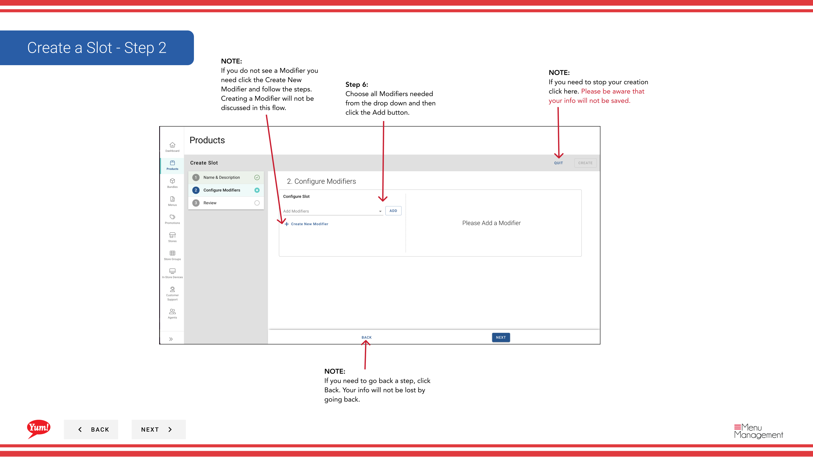
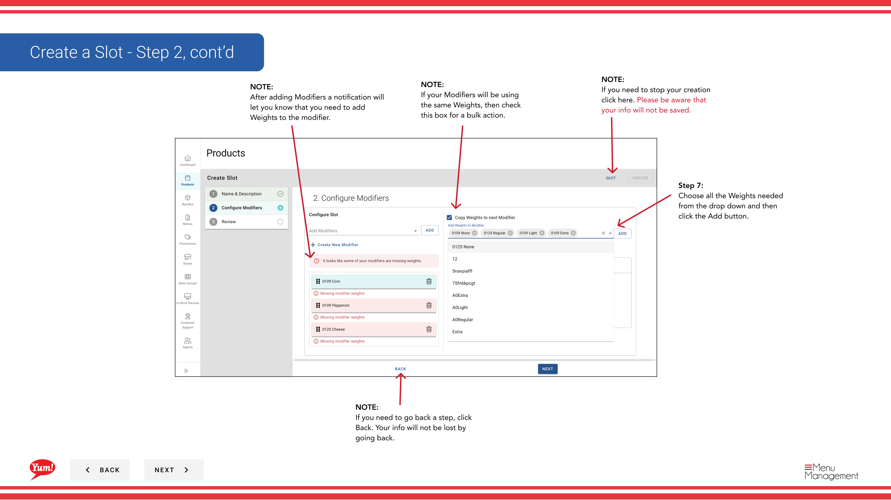

# Crear una Ranura

## Qué cubre esta guía

Crea una posición dentro de un producto donde se pueden colocar los modificadores (por ejemplo, “Selección de Sauce”, “Opciones de Queso”), estructurando cómo se presentan los complementos a los clientes.

## Pasos

### Paso 1: Información básica de Ranura

**Step 1:** Navegue a la sección **Productos** usando el menú de navegación izquierdo.

**Step 2:** Haga clic en la pestaña **Slots**.

**Step 3:** Haga clic en el botón **+ Crear nueva ranura**.

**Step 4:** Llenar los detalles de la ranura. Se requieren campos marcados con *.

| Campo | Qué entrar | Notas |
|-------|--------------|-------|
| * Código de la trama* | Unico identificador para esta ranura | Use letras mayúsculas, números e hifénes (por ejemplo, “SLOT-SAUCE”) |
| **Slot Name** | Describe lo que la personalización ofrece esta ranura | e.g., “Selección de Sauce”, “Opciones de Queso” |
| *Min Quantity* | Número mínimo de selecciones de modificadores necesarias | 0 = opcional |
| **Max Quantity** | Número máximo de selecciones modificadoras permitidas | Leave blank for unlimited |

**Step 5:** Cuando haya terminado, haga clic en **Siguiente** para proceder a la página Modificadores.

### Paso 2: Añadir Modificadores

**Step 6:** Seleccione todos los modificadores necesarios para esta ranura desde el desplegable, luego haga clic en **Añadir** para cada uno.

**Step 7:** Si no ves el modificador que necesitas, haz clic en **Crear nuevo modificador** para crearlo primero.

**Step 8:** Para reordenar los modificadores, haga clic y arrastre el mango de arrastrar de seis puntos.

**Step 9:** Haga clic en **Siguiente** para proceder a la página de Pesos.

### Paso 3: Agregar pesos

**Step 10:** Seleccione opciones de peso (tamaños de porción) para cada modificador desde el desplegable, luego haga clic en **Añadir**.

**Step 11:** Si varios modificadores comparten los mismos pesos, compruebe la caja **Aplicar a todos** para asignar esos pesos a todos los modificadores a la vez.

**Step 12:** Para reordenar pesos, haga clic y arrastre el mango de arrastrar seis puntos.

**Step 13:** Haga clic en **Crear** para guardar la ranura.

## Notas

:::caution
Clicking **Cancel** descarta toda la información no salvada.
:::

:::
Si no ves un modificador que necesitas, haz clic en **Crear nuevo modificador** para añadirlo antes de proceder.
:::

:::
Puede reordenar los modificadores y pesos usando los mangos de arrastre de seis puntos.
:::

:::
Utilice **Aplicar a todos** para asignar rápidamente los mismos pesos a múltiples modificadores a la vez.
:::

:::
Puedes volver a los pasos anteriores haciendo clic en **Volver** sin perder información.
:::

---

*Part of the[Guía del Portal de Admin](/docs/admin-portal-guide)· Sección: Productos*