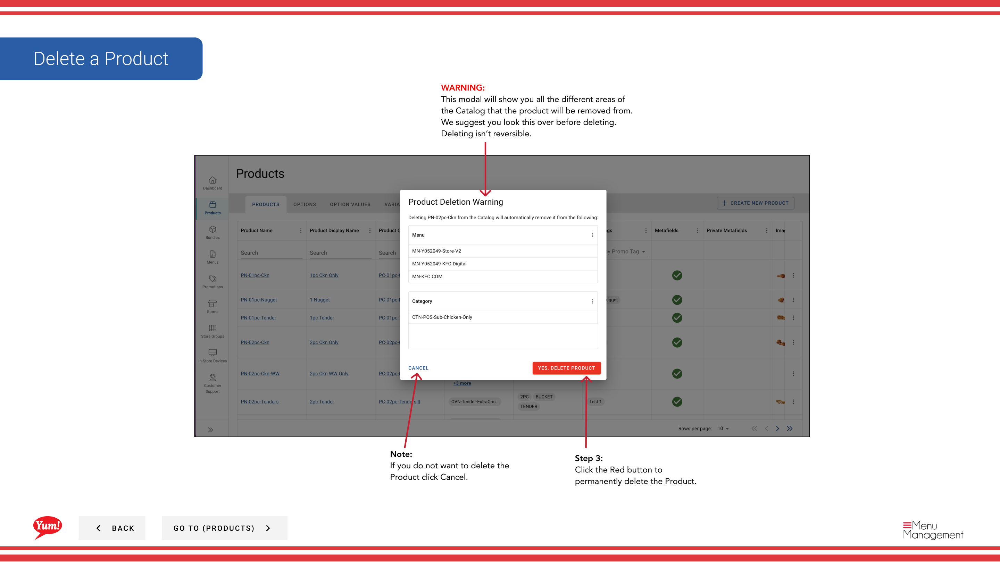

# Eliminar un producto

## Qué cubre esta guía

Elimina permanentemente un producto del sistema cuando se suspende o se creó en error.

## Pasos

**Step 1:** Navegue a la sección **Productos** usando el menú de navegación izquierdo.

**Step 2:** Encuentra el producto que quieres eliminar. Puede buscar por Nombre del Producto o Código del Producto.

**Step 3:** Haga clic en el menú de tres puntos junto al nombre del producto, a continuación, seleccione **Delete**.

**Step 4:** Un modal de confirmación aparecerá mostrando todas las áreas del sistema donde se utiliza este producto. Revise esto cuidadosamente para asegurarse de que está eliminando el artículo correcto.

**Step 5:** Haga clic en el botón rojo **Eliminar** para eliminar permanentemente el producto.

## Notas

:::caution
Eliminar un producto es permanente y no se puede deshacer. El producto se eliminará de todos los menús y áreas asociadas del catálogo.
:::

:::
Puede buscar productos por Nombre del Producto o Código del Producto para encontrar rápidamente el artículo que desea eliminar.
:::

:::caution
Haga clic en **Cancel** si no desea proceder con la eliminación.
:::

---

*Part of the[Guía del Portal de Admin](/docs/admin-portal-guide)· Sección: Productos*