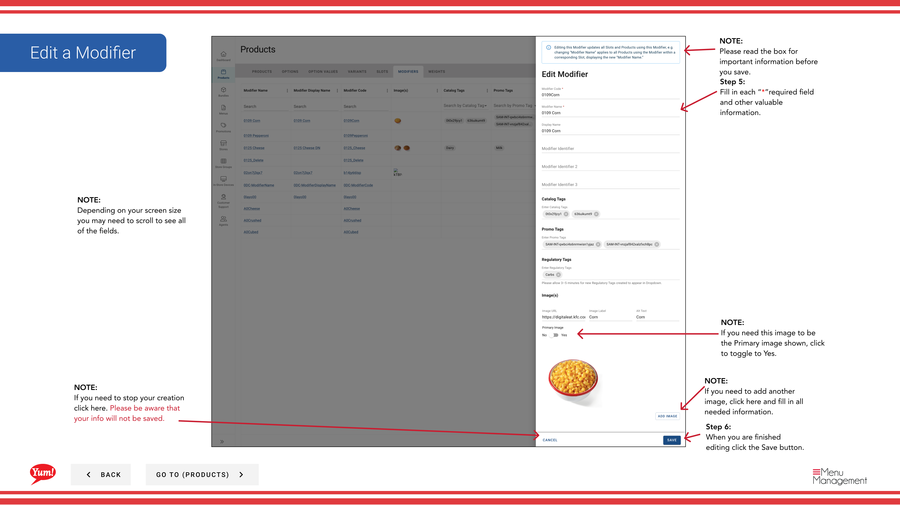

# Editar un Modificador

## Qué cubre esta guía

Actualiza los detalles de un modificador como nombre, precio, imágenes u otras propiedades.

## Pasos

**Step 1:** Navegue a la sección **Productos** usando el menú de navegación izquierdo.

**Step 2:** Haga clic en la pestaña **Modificadores**.

**Step 3:** Busque el modificador que desea editar introduciendo el Nombre, Código o etiqueta de catálogo en el campo de búsqueda.

**Step 4:** Haga clic en el menú de tres puntos junto al modificador, luego seleccione **Editar**.

**Step 5:** Actualice los detalles del modificador. Se requieren campos marcados con *.

| Campo | Qué entrar | Notas |
|-------|--------------|-------|
| * Código modificador* | Unico identificador | No se puede cambiar después de la creación |
| ** Nombre del modificador** | Nombre mostrado a los clientes | por ejemplo, “Extra Cheese”, “No Pickles”, “Extra Sauce” |
| *Precio* | Cargo adicional para este modificador | Entra`0`si no hay cargo extra |
| **Imagen* | Imagen opcional para este modificador | Toggle **Primary Image** a Sí para establecer como imagen de pantalla principal. Haga clic en **Añadir otra imagen** para añadir más. |

**Step 6:** Cuando termine de editar, haga clic en el botón **Guardar**.

## Notas

:::caution
Clicking **Cancel** descarta todos los cambios sin salvar.
:::

:::
Toggle **Imagen primaria** a **Sí** si esta imagen debería ser la imagen principal de este modificador.
:::

:::
Puede añadir varias imágenes haciendo clic en **Añadir otra imagen**.
:::

:::
Puede buscar modificadores por Nombre, Código o etiqueta de catálogo.
:::

---

*Part of the[Guía del Portal de Admin](/docs/admin-portal-guide)· Sección: Productos*