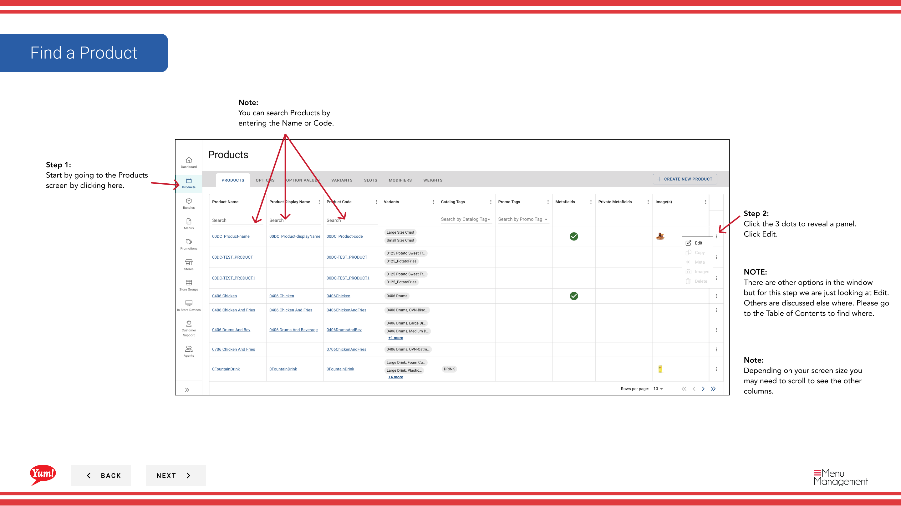

# Editar un producto

## Qué cubre esta guía

Actualiza la información de un producto existente como nombre, descripción, imágenes, precios o disponibilidad para reflejar cambios de menú, correcciones o actualizaciones de marca sin recrear el artículo.

## Pasos

**Step 1:** Navegue a la sección **Productos** usando el menú de navegación izquierdo.

**Step 2:** Encuentra el producto que quieres editar. Usted puede buscar entrando en el Nombre del Producto o Código del Producto en el campo de búsqueda.

**Step 3:** Haga clic en el menú de tres puntos junto al nombre del producto, a continuación, seleccione **Editar**.

**Step 4:** Usted verá el formulario de edición con todas las páginas del proceso de creación. Para saltar directamente a una sección, haga clic en el encabezado de sección azul (por ejemplo, “Información básica”, “Opciones”, “Variantes”). Para navegar paso a paso, haga clic en **Siguiente**.

**Step 5:** Haz tus cambios. Se requieren campos marcados con *. Sólo el botón **Guardar** estará activo cuando haya hecho cambios.

**Step 6:** Cuando haya terminado sus ediciones, haga clic en el botón **Guardar**.

## Notas

:::caution
Clicking **Cancel** descarta todos los cambios sin salvar.
:::

:::
Puede buscar productos por Nombre del Producto o Código del Producto para encontrar rápidamente el artículo que desea editar.
:::

:::
Haga clic en los encabezados de sección azul para saltar directamente a la sección que desea editar en lugar de navegar paso a paso.
:::

---

*Part of the[Guía del Portal de Admin](/docs/admin-portal-guide)· Sección: Productos*