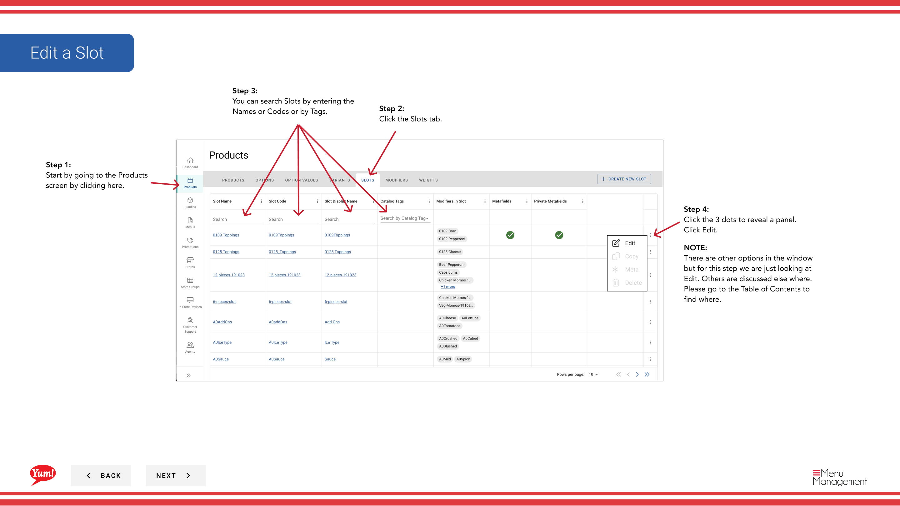

# Editar una Ranura

## Qué cubre esta guía

Actualiza la configuración de una ranura existente, como su etiqueta, cantidades mínimas/máximo, modificadores o pesos.

## Pasos

**Step 1:** Navegue a la sección **Productos** usando el menú de navegación izquierdo.

**Step 2:** Haga clic en la pestaña **Slots**.

**Step 3:** Busque la ranura que desea editar introduciendo el Nombre de Ranura, Código de Ranura, o Etiqueta en el campo de búsqueda.

**Step 4:** Haga clic en el menú de tres puntos junto a la ranura, a continuación, seleccione **Edit**.

**Step 5:** Usted verá los detalles de la ranura con enlaces de sección azul. Haga clic en cualquier enlace azul para saltar directamente a esa sección:
- **Información básica** — Editar código de ranura, nombre, min/max cantidades
- **Modificadores** — Añadir, eliminar o reordenar los modificadores
- **Pesas** Añadir, eliminar o reordenar opciones de peso

**Step 6:** Editar las áreas según sea necesario. Se requieren campos marcados con *.

| Campo | Qué entrar | Notas |
|-------|--------------|-------|
| * Código de la trama* | Unico identificador | No se puede cambiar después de la creación |
| **Slot Name** | Describe lo que la personalización ofrece esta ranura | e.g., “Selección de Sauce”, “Opciones de Queso” |
| *Min Quantity* | Seleccionamientos mínimos de modificadores requeridos | 0 = opcional |
| **Max Quantity** | Se permiten selecciones de modificador máximo | Leave blank for unlimited |

**Step 7:** Cuando termine con sus ediciones, haga clic en el botón **Guardar**.

## Notas

:::caution
Clicking **Cancel** descarta todos los cambios sin salvar.
:::

:::
Puede saltar directamente a una sección haciendo clic en el enlace de sección azul en lugar de desplazarse.
:::

:::
Usted puede buscar ranuras por Nombre de Ranura, Código de Ranura, o Tag para encontrar rápidamente el artículo que desea editar.
:::

---

*Part of the[Guía del Portal de Admin](/docs/admin-portal-guide)· Sección: Productos*