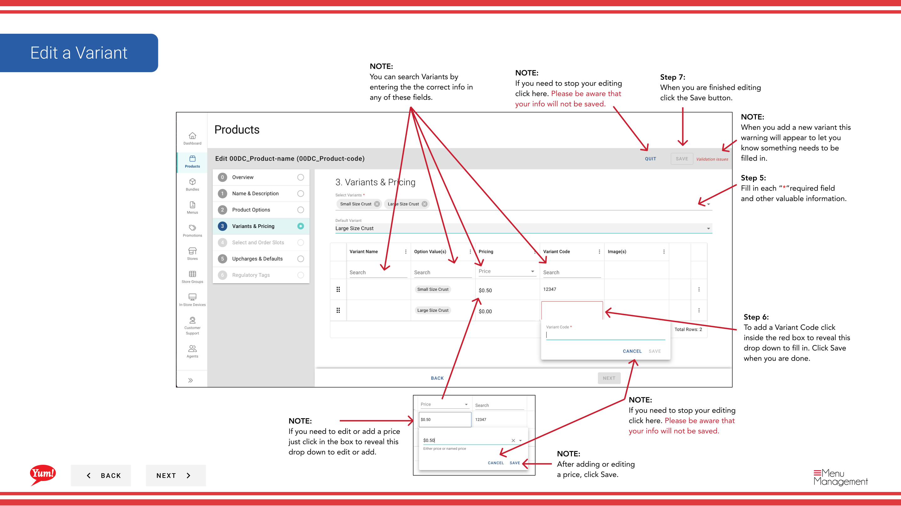

# Editar una variable

## Qué cubre esta guía

Actualiza el código de una variante de producto, precios, ranuras, disponibilidad, información nutricional, alérgenos, exclusiones o imágenes después de que el producto haya sido creado.

## Pasos

**Step 1:** Navegue a la sección **Productos** usando el menú de navegación izquierdo.

**Step 2:** Haga clic en la pestaña **Variantes**.

**Step 3:** Busque la variante que desea editar introduciendo el Nombre del Producto, Valores de Opción o Tags en el campo de búsqueda.

**Step 4:** Haga clic en el menú de tres puntos junto a la variante, luego seleccione **Editar**.

**Step 5:** Verá el formulario de edición variante con enlaces de sección azul. Haga clic en cualquier enlace azul para saltar directamente a esa sección:
- **Información básica** — Editar el código de variantes
- **Precio** - Agregar o editar precios de variante
- **Slots** Agregar o editar asignaciones de ranura
- ** Disponibilidad** - Establecer ventanas de disponibilidad basadas en el tiempo
- **Nutrición** - Añada información nutricional
- **Alergens/Exclusiones** - Comprobar los alergenos aplicables
- **Imágenes** Agregar o editar imágenes variante

**Step 6:** Actualizar los detalles de la variante según sea necesario. Se requieren campos marcados con *.

### Código Variante
Haga clic en el campo ** Código Variante** para editarlo. Haga clic en **Guardar** cuando se hace. Hacer clic en **Cancel** no guardará el código.

### Precios
Haga clic en el precio para revelar el campo de entrada de precio. Introduzca el precio y haga clic en **Guardar**.

### Disponibilidad
Haga clic en ** Disponibilidad** para establecer ventanas basadas en el tiempo (por ejemplo, “Breakfast 6am–11am”). Haga clic en **Añadir Disponibilidad** para añadir varias ventanas. Haga clic en **Guardar** cuando se hace.

### Información sobre nutrición
Haga clic en el menú de tres puntos junto a las entradas de nutrición y seleccione **Editar** para actualizar, o haga clic en **Añadir información de nutrición** para añadir nuevas entradas. Haga clic en **Guardar** cuando se hace.

### Alérgenos/Exclusiones
Revise todas las cajas que se aplican a esta variante. Haga clic en **Guardar** cuando se hace.

### Imágenes
Haga clic en **Añadir imagen** para subir imágenes. Toggle **Primary Image** a Sí si esta debe ser la imagen principal de la pantalla. Haga clic en **Guardar** cuando se hace.

**Step 7:** Cuando termine con todas las ediciones, haga clic en el botón **Guardar** en cada sección. El botón Guardar funciona de la misma manera a través de todos los cajones.

## Notas

:::caution
Haciendo clic en **Cancel** en cualquier cajón descarta todos los cambios no guardados en esa sección.
:::

:::
Puede saltar directamente a una sección haciendo clic en el enlace de sección azul en lugar de desplazarse.
:::

:::
Puede buscar variantes por Nombre del producto, Valores de opción, o Tags para encontrar rápidamente el artículo que desea editar.
:::

:::
Después de añadir o editar precios, haga clic en **Guardar** antes de pasar a otra sección.
:::

:::
Toggle **Primary Image** a **Sí** para establecer esta imagen como la imagen principal de la pantalla para esta variante.
:::

---

*Part of the[Guía del Portal de Admin](/docs/admin-portal-guide)· Sección: Productos*