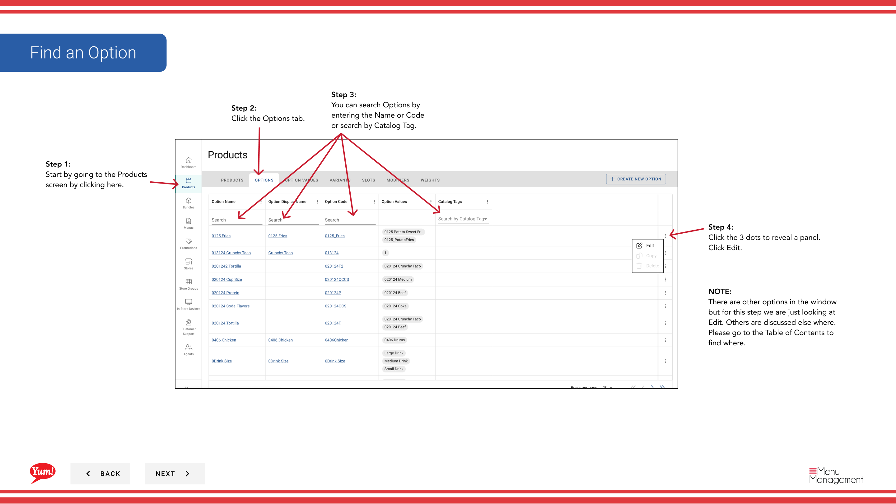

# Editar una opción

## Qué cubre esta guía

Actualiza el nombre o configuración de una opción existente para reflejar los cambios de menú o UX.

## Pasos

**Step 1:** Navegue a la sección **Productos** usando el menú de navegación izquierdo.

**Step 2:** Haga clic en la pestaña **Opciones**.

**Step 3:** Busque la opción que desee editar introduciendo el Nombre de opción, Código de opción o etiqueta de catálogo en el campo de búsqueda.

**Step 4:** Haga clic en el menú de tres puntos junto a la opción, luego seleccione **Editar**.

**Step 5:** Actualizar los detalles de la opción. Se requieren campos marcados con *.

| Campo | Qué entrar | Notas |
|-------|--------------|-------|
| * Código de aprobación* | Identificador único para esta opción | No se puede cambiar después de la creación |
| **Option Name** | El nombre de la categoría de personalización mostrado a los clientes | e.g., “Tamaño”, “Flavor”, “Espejo” |

**Step 6:** Para agregar o gestionar valores de opción (las opciones individuales dentro de esta opción), haga clic en **Agregar valor de opción** o gestionar los valores existentes en la sección siguiente.

**Step 7:** Cuando termines con tus ediciones, haz clic en **Guardar**.

## Notas

:::caution
Clicking **Cancel** descarta todos los cambios sin salvar.
:::

:::
Puede añadir nuevos valores de opción haciendo clic en **Añadir valor de opción**. Si necesita crear un valor de opción separado, consulte la guía “Crear un valor de opción”.
:::

:::
Puedes buscar opciones por Option Name, Option Code o Catalog Tag.
:::

---

*Part of the[Guía del Portal de Admin](/docs/admin-portal-guide)· Sección: Productos*