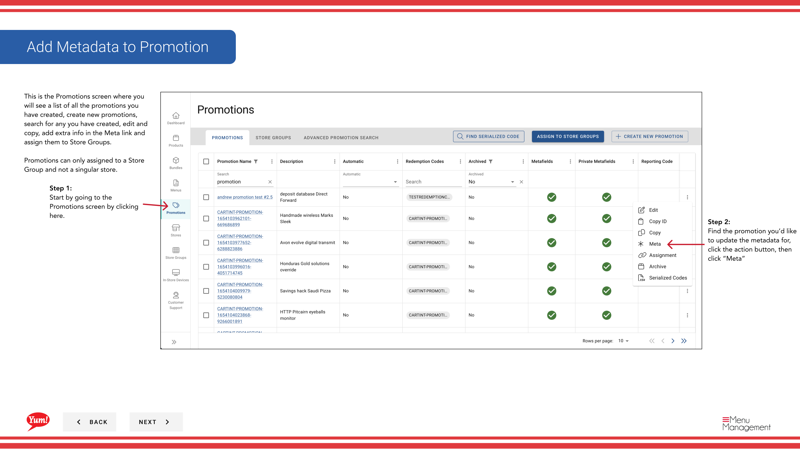

# Añadir metadatos a la promoción

## Qué cubre esta guía

Adjunta metadatos personalizados (pares de valor clave) a una promoción para la integración del sistema o necesidades de seguimiento específicas del mercado.

## Pasos

**Step 1:** Navegue a la sección **Promociones** utilizando el menú de navegación de la mano izquierda.

**Step 2:** Encuentra la promoción que quieres actualizar. Haga clic en el botón **acción del menú** (tres puntos), luego seleccione **Meta**.

**Step 3:** El mago de Metadatos se abrirá. Puedes añadir tanto los metacampos públicos como privados.

**Step 4:** Para agregar un metafield, haga clic en el botón **+ Agregar Metafield**. Ingrese lo siguiente:

| Campo | Qué entrar | Notas |
|-------|--------------|-------|
| *Key* | El nombre del campo de metadatos | por ejemplo, “campaign id”, “región”. Definido por su equipo técnico. |
| * Valor* | El valor de este campo | por ejemplo, “CAMP123”, “APAC”. Debe coincidir con el formato que sus integraciones esperan. |
| **Publicado/Privado** | Toggle para especificar la visibilidad | Los metadatos públicos son visibles para las integraciones. El privado es para el rastreo interno. |

**Step 5:** Haga clic en el botón **Guardar** para aplicar los metadatos.

:::note
Sólo agregue metadatos si su equipo técnico ha especificado las claves exactas y los valores requeridos para las integraciones de su sistema. Los metadatos se utilizan para transmitir datos adicionales a los sistemas conectados.
:::

## Guías relacionadas

- [Crear una promoción](/docs/admin-portal-guide/promotions/create-a-promotion/)
- [Editar una promoción](/docs/admin-portal-guide/promotions/edit-a-promotion/)

---

*Part of the[Guía del Portal de Admin](/docs/admin-portal-guide)· Sección: Promoción*