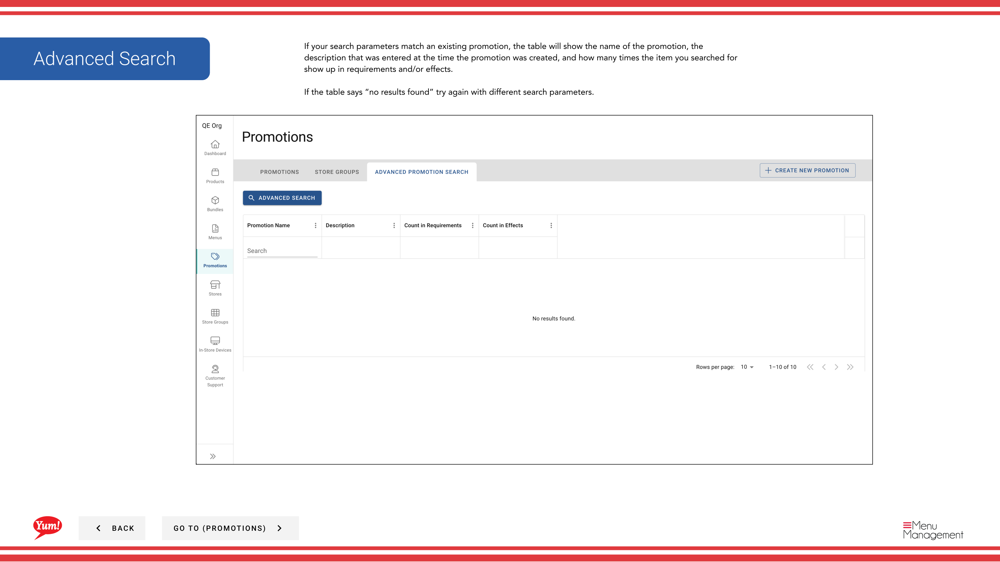

# Búsqueda avanzada de promociones

## Qué cubre esta guía

Proporciona capacidades de filtración y búsqueda mejoradas en todas las promociones, permitiendo a los operadores localizar promociones específicas por criterios complejos — útiles al buscar todas las promociones que contengan un artículo, etiqueta o condición específico.

## Pasos

**Step 1:** Navegue a la sección **Promociones** utilizando el menú de navegación de la mano izquierda.

**Step 2:** Haga clic en la pestaña ** Grupos de tareas**.

**Step 3:** Haga clic en el botón ** Búsqueda avanzada**.

**Step 4:** Seleccione dónde buscar su elemento de destino eligiendo desde el desplegable:

| Opción | Significado |
|--------|---------|
| **Requisitos** | Buscar sólo dentro de los requisitos de promoción |
| **Efectos** | Buscar sólo dentro de los efectos de promoción |
| *Ambos* | Búsqueda en ambos requisitos y efectos |

**Step 5:** Haga clic en el botón **Búsqueda** para popular la tabla de resultados.

**Step 6:** Refina tu búsqueda seleccionando:

- **Tipo de item** — Filtrar por el tipo de artículo que está buscando
- **Promo Tag** — Filtro por etiqueta de promoción

A continuación, seleccione el artículo específico o la etiqueta que desea buscar.

**Step 7:** Revisa los resultados de la búsqueda. La tabla mostrará:

- ** Nombre de promoción** El nombre de la promoción de juego
- **Descripción** La descripción entró cuando se creó la promoción
- ** Cuenta de captura** ¿Cuántas veces aparece el artículo en requisitos y/o efectos

:::
Si no se encuentran resultados, intente ajustar los parámetros de búsqueda o utilizando diferentes tipos de elementos o etiquetas.
:::

## Guías relacionadas

- [Crear una promoción](/docs/admin-portal-guide/promotions/create-a-promotion/)
- [Editar una promoción](/docs/admin-portal-guide/promotions/edit-a-promotion/)

---

*Part of the[Guía del Portal de Admin](/docs/admin-portal-guide)· Sección: Promoción*