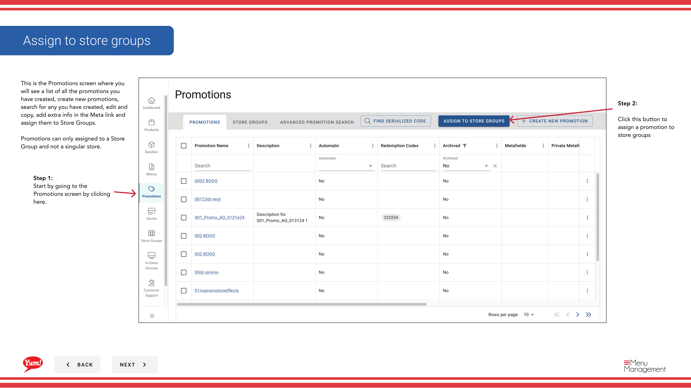

# Assign Promotions to Store Groups

## Qué cubre esta guía

Enlaces promociones existentes para almacenar grupos, haciéndolos activos para todas las tiendas dentro de esos grupos simultáneamente.

## Pasos

**Step 1:** Navegue a la sección **Promociones** utilizando el menú de navegación de la mano izquierda.

**Step 2:** Haga clic en el botón **Assign Promotions to Store Groups** (o botón equivalente en la pantalla).

**Step 3:** Seleccione la promoción (s) que desea asignar. Puedes:

- **Compruebe la casilla** junto a cada nombre de promoción
- **Utilice la opción "Select All"** para seleccionar todas las promociones visibles (o deseleccionar usando "Deselect All")
- **Buscar** para promociones específicas utilizando la barra de búsqueda

**Step 4:** Una vez que haya seleccionado sus promociones, haga clic en **Siguiente** o haga clic en el siguiente indicador de paso para proceder.

**Step 5:** Seleccione el grupo(s) de la tienda que debe recibir estas promociones. Puedes:

- **Compruebe la casilla** junto a cada nombre del grupo de la tienda
- **Buscar** para grupos específicos de tiendas utilizando la barra de búsqueda

**Step 6:** Revise sus selecciones y haga clic en el botón **Assign** para aplicar las promociones a los grupos de tiendas seleccionados.

:::note
Las promociones sólo pueden ser asignadas para almacenar grupos, no para tiendas individuales. Una vez asignados, las promociones se activan inmediatamente para todas las tiendas de esos grupos y se muestran en sus canales de pedidos digitales.
:::

:::
También puede asignar promociones de la sección Grupos de Tienda. Véase[Assign Promotions](/docs/admin-portal-guide/store-groups/assign-promotions/)para ese flujo de trabajo.
:::

## Guías relacionadas

- [Crear una promoción](/docs/admin-portal-guide/promotions/create-a-promotion/)
- [Crear un grupo de tiendas](/docs/admin-portal-guide/promotions/create-a-store-group/)
- [View Promotions for a Store Group](/docs/admin-portal-guide/promotions/view-promotions-for-a-store-group/)
- [Assign Promotions (Store Groups section)](/docs/admin-portal-guide/store-groups/assign-promotions/)

---

*Part of the[Guía del Portal de Admin](/docs/admin-portal-guide)· Sección: Promoción*