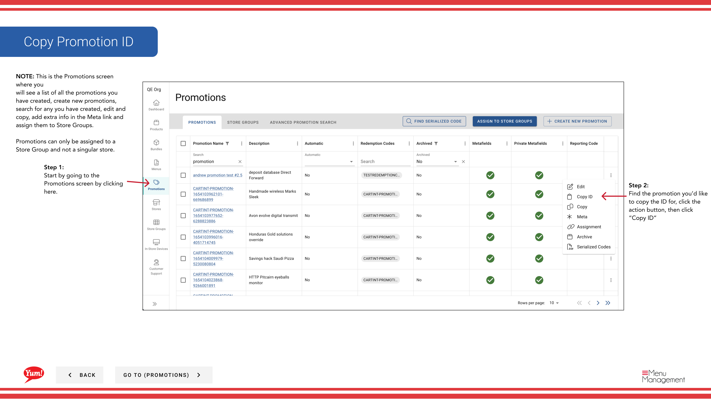

# ID de promoción

## Qué cubre esta guía

Copia el ID único de una promoción a su portapapeles para su uso en tickets de soporte, integraciones del sistema o referencias cruzadas con otros sistemas.

## Pasos

**Step 1:** Navegue a la sección **Promociones** utilizando el menú de navegación de la mano izquierda.

**Step 2:** Encuentra la promoción para la que quieres copiar el ID. Haga clic en el botón de menú **acción** (tres puntos), a continuación, seleccione **Copiar ID**.

**Step 3:** El ID de promoción ha sido copiado a su portapapeles. Ahora puede pegarlo en tickets de apoyo, formularios de integración u otros sistemas según sea necesario.

:::note
El ID de promoción es un identificador único asignado por Atlas. Los equipos técnicos utilizan este ID para hacer referencia a la promoción en integraciones, depuración y registros del sistema.
:::

## Guías relacionadas

- [Crear una promoción](/docs/admin-portal-guide/promotions/create-a-promotion/)
- [Añadir metadatos a la promoción](/docs/admin-portal-guide/promotions/add-metadata-to-promotion/)

---

*Part of the[Guía del Portal de Admin](/docs/admin-portal-guide)· Sección: Promoción*