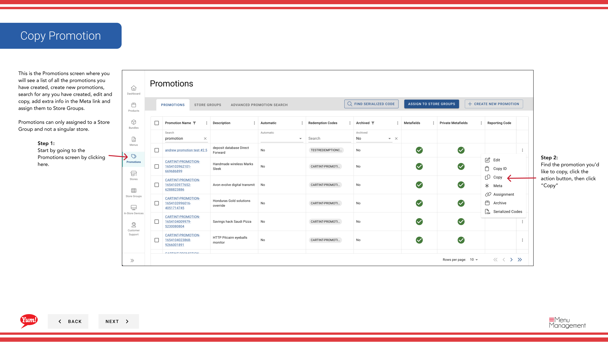
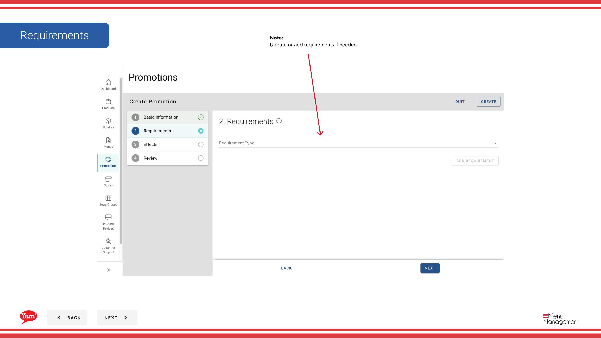

# Copy Promotion

## Qué cubre esta guía

Duplica una promoción existente como punto de partida para una nueva, reduciendo el tiempo de configuración para ofertas similares.

## Pasos

**Step 1:** Navegue a la sección **Promociones** utilizando el menú de navegación de la mano izquierda.

**Step 2:** Encuentra la promoción que quieres copiar. Haga clic en el botón de menú **acción** (tres puntos), luego seleccione **Copiar**.

**Step 3:** El Asistente de Promoción se abrirá con todos los detalles de la promoción original pre-filled. Actualizar los detalles de promoción según sea necesario:

- **Nombre de promoción** — La promoción copiada predetermina a “Copy of - [Nombre original]”. Cambia esto a un nombre único.
- **Display Name** — Update if needed.
- **Descripción** — Actualizar si es necesario.
- ** Flujo de promoción** — Cambio si es necesario.
- **Requisitos** — Agregue, retire o modifique según sea necesario.
- **Efectos** — Añadir, eliminar o modificar según sea necesario.

**Step 4:** Revise todos sus cambios y haga clic en el botón **Crear** para guardar la nueva promoción.

:::note
La promoción copiada es independiente del original. Los cambios realizados para cualquiera de los ascensos no afectarán al otro.
:::

## Guías relacionadas

- [Crear una promoción](/docs/admin-portal-guide/promotions/create-a-promotion/)
- [Editar una promoción](/docs/admin-portal-guide/promotions/edit-a-promotion/)
- [Assign Promotions to Store Groups](/docs/admin-portal-guide/promotions/assign-promotions-to-store-groups/)

---

*Part of the[Guía del Portal de Admin](/docs/admin-portal-guide)· Sección: Promoción*