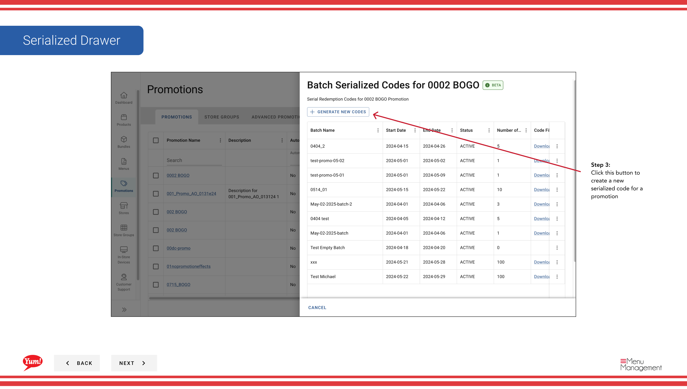

# Crear Código Serializado

## Qué cubre esta guía

Genera códigos promocionales únicos atados a una promoción, utilizados para campañas de redención rastreadas donde cada cliente recibe un código distinto.

## Pasos

**Step 1:** Navegue a la sección **Promociones** utilizando el menú de navegación de la mano izquierda.

**Step 2:** Encuentra la promoción para la cual quieres crear códigos serializados. Haga clic en el botón de menú **acción** (tres puntos), luego seleccione **Código serializado**.

**Step 3:** Haga clic en el botón **+ Crear nuevo código serializado** (o el botón equivalente que se muestra en la pantalla).

**Step 4:** Rellene el formulario de código serializado con los siguientes detalles:

| Campo | Qué entrar | Notas |
|-------|--------------|-------|
| Prefijo | Texto opcional para añadir al inicio de cada código | por ejemplo, “KFC-”, “BOGO2024-”. Deja en blanco si no se necesita prefijo. |
| *Cuantidad* | Número de códigos para generar | por ejemplo, “100”, “5000”. Determina cuántos códigos únicos se crean. |
| **Fecha de consulta** | Cuando los códigos caducan | Seleccione la fecha después de la cual los códigos no pueden ser redimidos. |

**Step 5:** Haga clic en **Generar códigos** para crear y agregar los códigos a la lista de códigos serializados.

:::note
Los códigos serializados son códigos de redención únicos de uso único. Cada código sólo puede ser redimido una vez. Una vez generados, se agregan códigos a la promoción y listos para su distribución a los clientes.
:::

## Guías relacionadas

- [Encontrar Código Serializado](/docs/admin-portal-guide/promotions/find-serialized-code/)
- [Crear una promoción](/docs/admin-portal-guide/promotions/create-a-promotion/)

---

*Part of the[Guía del Portal de Admin](/docs/admin-portal-guide)· Sección: Promoción*