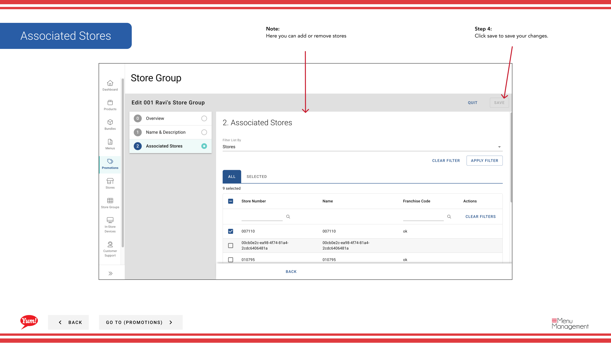

# Editar un grupo de tiendas

## Qué cubre esta guía

Actualiza los detalles o la membresía de un grupo de tiendas.

## Pasos

**Step 1:** Comience por ir a la pantalla Promociones haciendo clic aquí.
**Step 2:** Haga clic en la pestaña Grupos de Tienda

**Step 3:** Encuentre el grupo de la tienda que desea editar y haga clic en el enlace de nombre del grupo de la tienda

**Step 4:** Haga clic en Guardar para guardar sus cambios.

## Notas

:::note
Hay múltiples maneras de editar un grupo de tiendas. Esta es la manera de hacerlo a través de Promociones. También puede hacerlo a través de Grupos de Tienda en la navegación principal.
:::

:::note
Aquí puede ver una visión general del nombre y descripción y tiendas asociadas
:::

:::note
Aquí puede actualizar el nombre y la descripción o almacenar etiquetas de grupo
:::

:::note
Aquí puede añadir o quitar las tiendas
:::

## Información adicional

- Promociones - Editar un grupo de tiendas
- Esta es la pantalla Promociones donde verá una lista de todas las promociones que ha creado, crear nuevas promociones, buscar cualquier que haya creado, editar y copiar, añadir información adicional en el enlace Meta y asignarlas a Grupos de Tienda. Las promociones sólo pueden asignarse a un grupo de tiendas y no a una tienda singular.

---

*Part of the[Guía del Portal de Admin](/docs/admin-portal-guide)· Sección: Promoción*