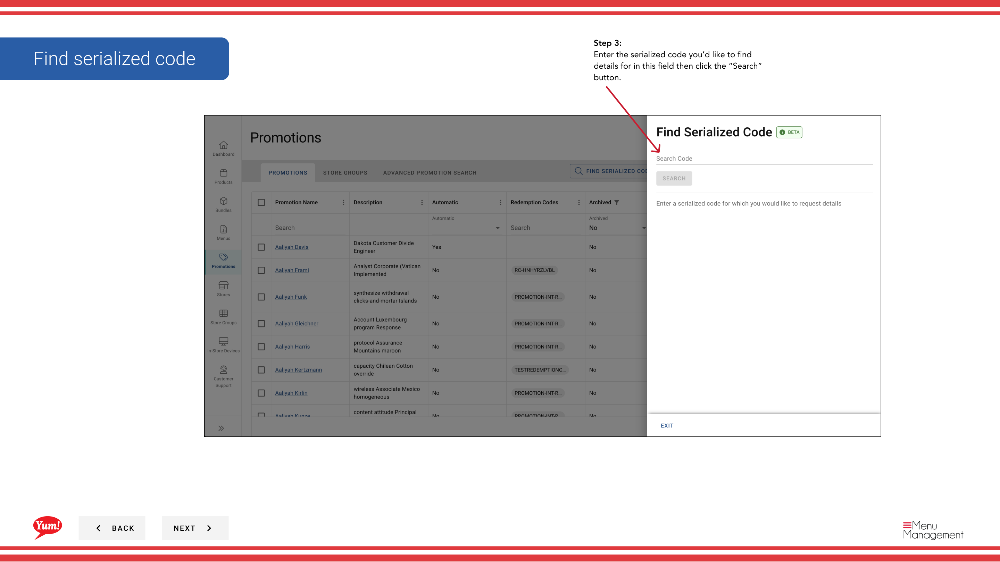

# Encontrar Código Serializado

## Qué cubre esta guía

Localiza un código de promoción serializado específico dentro de Atlas, utilizado al verificar el estado de redención, resolver problemas o gestionar la validez de código.

## Pasos

**Step 1:** Navegue a la sección **Promociones** utilizando el menú de navegación de la mano izquierda.

**Step 2:** Haga clic en el botón **Encuentra Código Serializado** (generalmente visible cerca de la lista de promociones).

**Step 3:** Introduzca el código serializado que desea buscar en el campo **búsqueda** y haga clic en el botón **Buscar**.

**Step 4:** El sistema mostrará los datos de código incluyendo:

- ** Valor del proyecto** El texto del código real
- ** Nombre de promoción** La promoción de este código está ligada a
- **Status** Si el código está activo, redimido o anulado
- **Fecha de consulta** Cuando el código expira

**Step 5 (Optional):** Si necesita desactivar un código, haga clic en el botón **Void Code**. Un código anulado no puede ser redimido.

:::note
Utilice esta característica para verificar que existe un código, comprobar su estado de redención, o solucionar problemas de los clientes con códigos específicos.
:::

## Guías relacionadas

- [Crear Código Serializado](/docs/admin-portal-guide/promotions/create-serialized-code/)
- [Crear una promoción](/docs/admin-portal-guide/promotions/create-a-promotion/)

---

*Part of the[Guía del Portal de Admin](/docs/admin-portal-guide)· Sección: Promoción*