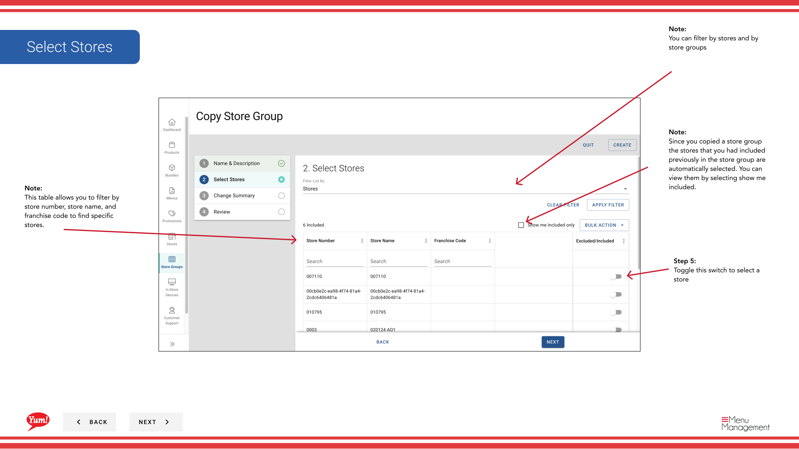

# Copiar un grupo de tiendas

## Qué cubre esta guía

Duplica una configuración de grupo de tiendas como punto de partida para un nuevo grupo, copiando tiendas y etiquetas pero creando un nuevo grupo de tiendas independiente.

## Pasos

**Step 1:** Navegue a la sección **Store Groups** utilizando el menú de navegación de la mano izquierda.

**Step 2:** Busque el grupo de la tienda que desea copiar navegando por la tabla o utilizando la barra de búsqueda. Haga clic en el botón **acción del menú** (tres puntos) junto al nombre del grupo de la tienda.

**Step 3:** Click **Copy**.

**Step 4:** Actualizar los detalles del grupo de la tienda:

| Campo | Qué entrar | Notas |
|-------|--------------|-------|
| **Store Group Name** | Un nuevo nombre único para este grupo | El sistema copia el nombre original; debe cambiarlo. Por ejemplo, "Grupo de Franquicia de la NV - Copia". |
| **Store Group Tags** | Etiquetas para filtrar y reportar | Las etiquetas del grupo original se incluyen automáticamente. Puede añadir o eliminar según sea necesario. |

**Step 5:** Revisar y ajustar la membresía de las tiendas si es necesario:

- **Las claves del grupo original se seleccionan automáticamente** (los interruptores de conmutación están encendidos)
- **Toggle OFF** para eliminar cualquier tienda que no desee en el nuevo grupo
- **Retrocede** para agregar tiendas adicionales
- Utilice el filtro **"Mostrarme incluido"** para ver rápidamente sólo tiendas seleccionadas
- **Filter by Store Number, Store Name o Franchise Code** para encontrar tiendas específicas

**Step 6:** Revise el resumen de todos los cambios y haga clic en el botón **Crear** para guardar el nuevo grupo de tiendas.

:::note
El grupo de tiendas copiadas es independiente del original. Los cambios realizados a ambos grupos no afectarán al otro. La membresía de la tienda se copia automáticamente del grupo original pero se puede modificar antes de guardar.
:::

## Guías relacionadas

- [Crear un grupo de tiendas](/docs/admin-portal-guide/store-groups/create-a-store-group/)
- [Editar un grupo de tiendas](/docs/admin-portal-guide/store-groups/edit-a-store-group/)
- [Eliminar un grupo de tiendas](/docs/admin-portal-guide/store-groups/delete-a-store-group/)

---

*Part of the[Guía del Portal de Admin](/docs/admin-portal-guide)· Sección: Grupos de tiendas*