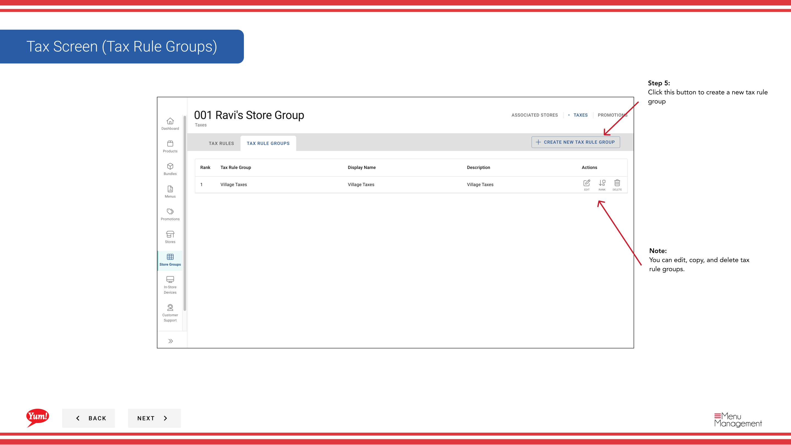

# Crear un grupo de reglas fiscales

## Qué cubre esta guía

Crea un grupo de reglas de impuestos que agrupa varias reglas de impuestos relacionadas, permitiendo organizar y reutilizar configuraciones de impuestos a través de grupos de tiendas.

## Pasos

**Step 1:** Navegue a la sección **Store Groups** utilizando el menú de navegación de la mano izquierda.

**Step 2:** Encuentra el grupo de la tienda donde quieres crear un grupo de reglas de impuestos. Haga clic en el botón **acción del menú** (tres puntos) junto al nombre del grupo de la tienda.

**Step 3:** Haga clic en **Taxes** del menú desplegable.

**Step 4:** Haga clic en la pestaña **Tax Rule Groups**.

**Step 5:** Haga clic en el botón **+ Crear nueva regla tributaria**.

**Step 6:** Rellene los detalles del grupo de reglas fiscales. Se requieren campos marcados con *.

| Campo | Qué entrar | Notas |
|-------|--------------|-------|
| **Tax Rule Group Name** | Nombre descriptivo para este grupo | Por ejemplo, "Standard GST Group", "NSW Reduced Tax Rules". Debe indicar qué impuestos se incluyen. |
| *Nombre del juego* | Nombre mostrado en la interfaz | Por lo general igual o similar al nombre del Grupo de Reglas Fiscales. |
| **Descripción** | Explicación opcional del propósito del grupo | e.g., "Reglas GST aplicables a los lugares de Nueva Gales del Sur". |

**Step 7:** Haga clic en el botón **Crear Grupo Fiscal** para guardar el grupo de reglas de impuestos.

:::note
Una vez creado, un grupo de reglas de impuestos es independiente y se puede utilizar en varios grupos de tiendas. Puede editar, copiar y eliminar grupos de reglas de impuestos en cualquier momento de esta pantalla.
:::

:::
Después de crear un grupo de reglas de impuestos, necesitará añadir reglas de impuestos individuales a él. Véase[Crear reglas fiscales](/docs/admin-portal-guide/store-groups/create-tax-rules/)para ese paso.
:::

## Guías relacionadas

- [Crear reglas fiscales](/docs/admin-portal-guide/store-groups/create-tax-rules/)
- [Editar un grupo de tiendas](/docs/admin-portal-guide/store-groups/edit-a-store-group/)

---

*Part of the[Guía del Portal de Admin](/docs/admin-portal-guide)· Sección: Grupos de tiendas*