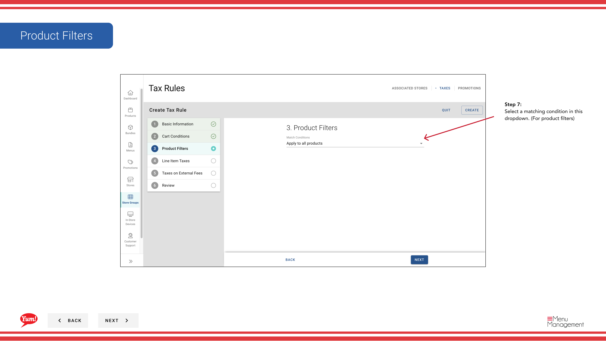

# Crear reglas fiscales

## Qué cubre esta guía

Define las reglas fiscales individuales dentro de un grupo de la tienda, especificando las tasas de impuestos, condiciones y filtros de producto aplicados a los artículos vendidos en las tiendas miembros.

## Pasos

**Step 1:** Navegue a la sección **Store Groups** utilizando el menú de navegación de la mano izquierda.

**Step 2:** Encuentra el grupo de la tienda donde quieres crear una regla de impuestos. Haga clic en el botón **acción del menú** (tres puntos) junto al nombre del grupo de la tienda.

**Step 3:** Haga clic en **Taxes** del menú desplegable.

**Step 4:** Haga clic en el botón **+ Crear nueva regla fiscal**.

**Step 5:** Rellene la información básica sobre la regla tributaria. Se requieren campos marcados con *.

| Campo | Qué entrar | Notas |
|-------|--------------|-------|
| **Nombre del texto** | Nombre interno de esta regla | Por ejemplo, "Standard GST 10%", "Delivery Surcharge Tax". Visible para los operadores. |
| **Efectivo desde la fecha** | Date this rule takes effect | Puedes usar fechas pasadas para registros históricos. Formato: DD/MM/YYYYY. |
| **Tax Rule Group** | Asignación a un grupo existente o nuevo | Opcional. Groups multiple related tax rules together for easier management. |

**Step 6:** Agregue las condiciones que desencadenan esta regla de impuestos. Esta sección es opcional.

| Campo | Qué entrar | Notas |
|-------|--------------|-------|
| ** Condiciones de la tarjeta** | Seleccione las condiciones basadas en el orden general | Por ejemplo, "Order contiene entrega", "Cart total excede $50". Elige desplegable. |
| ** Filtros de producto** | Seleccione qué productos/categorías se aplica a | Por ejemplo, "sólo los elementos del menú en la categoría Burgers". Elige desplegable. |

**Step 7:** Haga clic en el botón **+ Agregar impuesto** para definir el cálculo de impuestos.

**Step 8:** Rellene los detalles del cálculo fiscal:

| Campo | Qué entrar | Notas |
|-------|--------------|-------|
| Modo de destino** | Elija cómo se calcula el impuesto | **Porcentaje** (por ejemplo, 10% de GST) o ** Cantidad fija** (por ejemplo, 0,50 dólares por artículo) |
| **Aplicado a** | Lo que el impuesto aplica a | por ejemplo, Subtotal, tasas de entrega o categorías específicas de artículos |
| **Tax Amount %** | Ingrese la tasa de impuestos como porcentaje | Sólo para el modo porcentaje. Introduzca números solamente (por ejemplo,`10`para 10% GST) |

**Step 9:** (Opcional) Rellene **Taxes on External Fees** si necesita aplicar impuestos a las tarifas de las plataformas de entrega de terceros.

**Step 10:** Haga clic para crear la regla de impuestos. Una pantalla de revisión mostrará toda la información que has introducido. Haga clic en **Crear** para guardar.

:::note
Puede hacer clic en cualquier número de paso en el asistente para navegar a esa sección sin perder sus cambios. También puede editar, copiar y eliminar reglas fiscales después de la creación.
:::

:::
Crear un Grupo de Reglas Tributarias primero si desea organizar reglas fiscales relacionadas juntos. Véase[Crear un grupo de reglas fiscales](/docs/admin-portal-guide/store-groups/create-tax-rule-group/)para instrucciones.
:::

## Guías relacionadas

- [Crear un grupo de reglas fiscales](/docs/admin-portal-guide/store-groups/create-tax-rule-group/)
- [Editar un grupo de tiendas](/docs/admin-portal-guide/store-groups/edit-a-store-group/)

---

*Part of the[Guía del Portal de Admin](/docs/admin-portal-guide)· Sección: Grupos de tiendas*