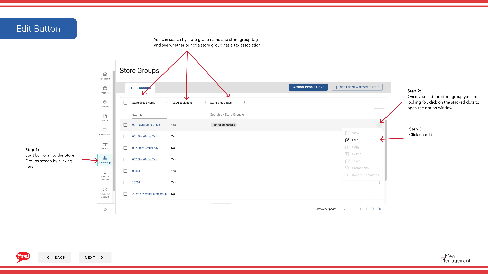
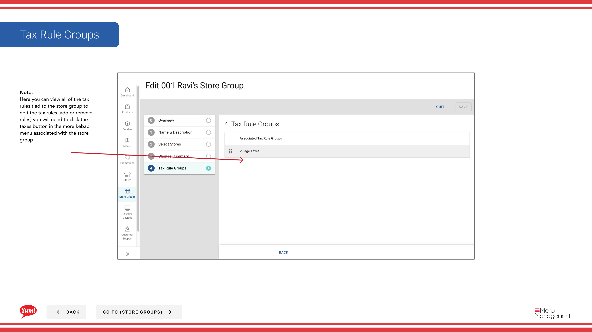

# Editar un grupo de tiendas

## Qué cubre esta guía

Actualiza los detalles de un grupo de tiendas, nombre, membresía de tiendas o reglas fiscales asociadas.

## Pasos

**Step 1:** Navegue a la sección **Store Groups** utilizando el menú de navegación de la mano izquierda.

**Step 2:** Busque el grupo de la tienda que desea editar navegando por la tabla o utilizando la barra de búsqueda. Haga clic en el botón **acción del menú** (tres puntos) junto al nombre del grupo de la tienda.

**Step 3:** Haga clic en **Editar**.

**Step 4:** Usted verá el Editor de Grupos de Tienda mostrando todos los detalles actuales y almacenar la membresía.

**Step 5:** Actualizar los detalles del grupo de la tienda según sea necesario:

| Campo | Qué actualizar | Notas |
|-------|----------------|-------|
| **Store Group Name** | Nombre descriptivo para el grupo | Por ejemplo, "Grupo de Franquicia de la NV". |
| **Store Group Tags** | Etiquetas para filtrar y reportar | por ejemplo, "pilot", "corporate". |

**Step 6:** Actualizar la membresía de la tienda por los interruptores de carga al lado de los nombres de la tienda:

- **Retrocede** para añadir una tienda al grupo
- **Realizar OFF** para quitar una tienda del grupo
- **Filter by Store Number, Store Name o Franchise Code** para encontrar tiendas específicas rápidamente

**Step 7:** Examinar el resumen que muestra todos los cambios realizados durante este período de sesiones. Haga clic en **Guardar** para aplicar las actualizaciones.

:::note
Puede hacer clic en cualquier número de paso en el asistente para saltar a esa sección sin perder sus cambios.
:::

:::
Si este grupo de tiendas tiene reglas fiscales, puede visualizarlas y editarlas haciendo clic en el botón **action menu** y seleccionando **Taxes**.
:::

## Guías relacionadas

- [Crear un grupo de tiendas](/docs/admin-portal-guide/store-groups/create-a-store-group/)
- [Copiar un grupo de tiendas](/docs/admin-portal-guide/store-groups/copy-a-store-group/)
- [Eliminar un grupo de tiendas](/docs/admin-portal-guide/store-groups/delete-a-store-group/)
- [View Stores in a Store Group](/docs/admin-portal-guide/store-groups/view-stores-in-a-store-group/)
- [Crear reglas fiscales](/docs/admin-portal-guide/store-groups/create-tax-rules/)

---

*Part of the[Guía del Portal de Admin](/docs/admin-portal-guide)· Sección: Grupos de tiendas*