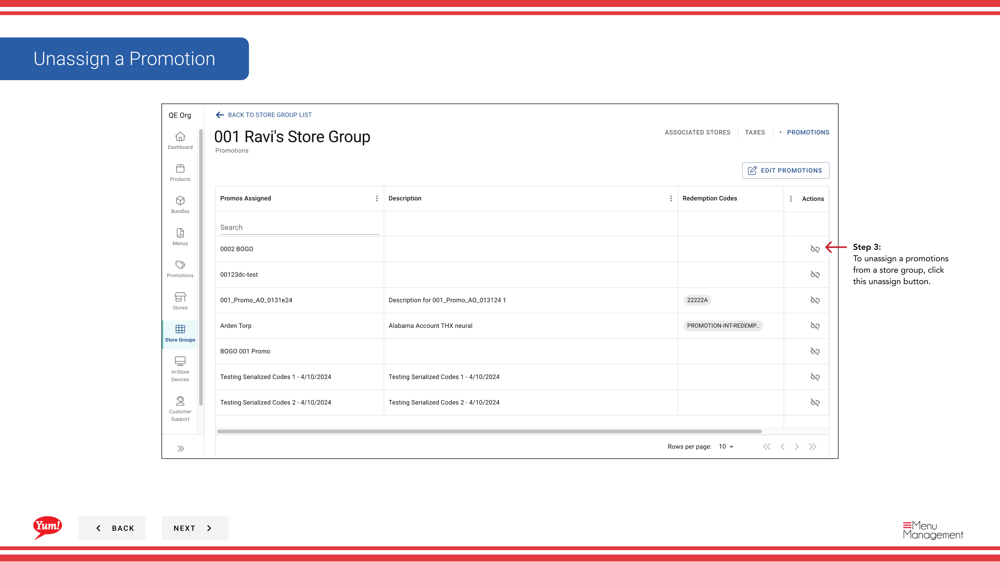

# Promociones del Grupo de Tiendas

## Qué cubre esta guía

Elimina una o más promociones de un grupo de tiendas, desactivarlas inmediatamente en todas las tiendas miembros.

## Pasos

**Step 1:** Navegue a la sección **Store Groups** utilizando el menú de navegación de la mano izquierda.

**Step 2:** Encuentra el grupo de la tienda cuyas promociones quieres eliminar. Haga clic en el botón de menú **acción** (tres puntos) junto al nombre del grupo de la tienda, luego haga clic en **Promociones**.

**Step 3:** Un cajón abrirá mostrando todas las promociones actualmente asignadas a este grupo de tiendas. Para eliminar una promoción, haga clic en el botón **Unassign** junto al nombre de promoción.

**Step 4:** Aparecerá un diálogo de confirmación. Haga clic en **Unassign Promotion** para confirmar la eliminación de la promoción de este grupo de tiendas.

:::caution
Sin firmar una promoción inmediatamente lo desactiva a través de todas las tiendas en este grupo de tiendas. Los clientes ya no verán esta promoción en sus canales de pedidos digitales.
:::

:::
Si desea agregar o eliminar múltiples promociones a la vez, utilice el[Editar promociones](/docs/admin-portal-guide/store-groups/edit-promotions/)flujo de trabajo en su lugar.
:::

## Guías relacionadas

- [Editar promociones](/docs/admin-portal-guide/store-groups/edit-promotions/)
- [Assign Promotions](/docs/admin-portal-guide/store-groups/assign-promotions/)
- [Promociones de importación para un grupo de tiendas](/docs/admin-portal-guide/store-groups/import-promotions-for-a-store-group/)

---

*Part of the[Guía del Portal de Admin](/docs/admin-portal-guide)· Sección: Grupos de tiendas*